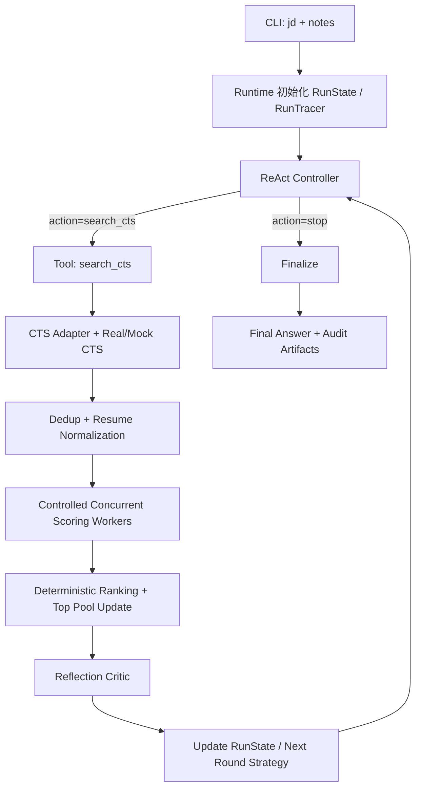
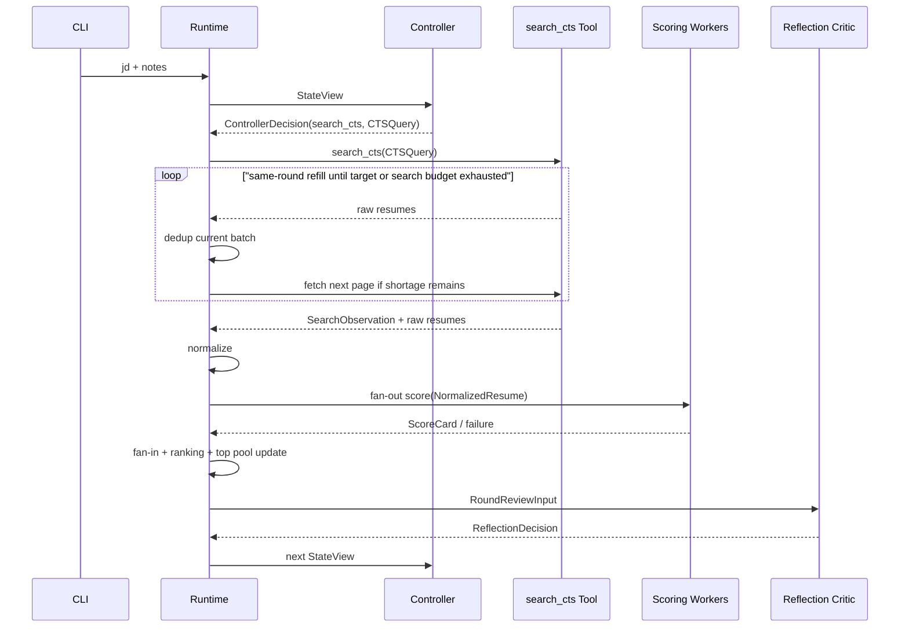

# SeekTalent v0.1 设计文档

## 0. 文档信息

- 版本：`v0.1`
- 状态：`design / approved for implementation`
- 文档目标：把当前项目收敛为一套更标准的 `ReAct + self-reflection` 架构，同时保持工程可审计、可复现、可扩展。
- 文档语言约定：正文使用中文，关键术语保留英文，例如 `ReAct`、`Controller`、`Runtime`、`Tool`、`Reflection`、`Memory`、`Trace`、`ScoreCard`。

---

## 1. 设计结论摘要

本版本的核心结论如下：

1. 整个系统不是 `multi-agent system`，也不应继续使用宽泛的 `agent` 命名描述所有模块。
2. 系统中只有一个真正意义上的 `Agent`：
   - `ReAct Controller`
3. 系统中只有一个对外暴露给 `Controller` 的 `Tool`：
   - `search_cts`
4. 其他步骤全部是 `deterministic workflow`：
   - `same-round refill after dedup`
   - `dedup`
   - `resume normalization`
   - `score fan-out / fan-in`
   - `deterministic ranking`
   - `top pool update`
   - `self-reflection`
   - `finalize`
5. `self-reflection` 是每轮结束后的固定步骤，不是 `Tool`，也不是可选行为。
6. 并发评分不做成真正的 `subagent collaboration`，而是做成受控并发的 `scoring workers`。
7. `trace.log` 只保留“短摘要时间线”；完整简历、完整评分卡、入选/淘汰原因、每轮评审信息写入独立的结构化审计文件。

一句话概括：

> `SeekTalent v0.1` 是一个 **single-controller ReAct workflow**。  
> `Controller` 负责“下一步搜什么 / 是否停止”，`Runtime` 负责“怎么执行和怎么审计”。

---

## 2. 背景与问题定义

### 2.1 当前问题

在当前实现中，虽然历史实现曾使用 `agent/` 目录名，但实际上：

- `strategy_bootstrap`
- `ResumeScorer`
- `ReflectionCritic`
- `Finalizer`

都不具备严格意义上的 `Agent` 特征。它们更接近：

- `LLM-backed step`
- `structured processor`
- `workflow component`

真正的流程控制仍由 Python 中的 `WorkflowRuntime` 显式完成。

这种实现本身并不错误，但命名和架构语义不够严格，容易造成以下认知偏差：

1. 误以为当前是 `multi-agent`。
2. 误以为评分、reflection、finalize 都是独立自治体。
3. 误以为工具调用和流程决策由 LLM 自主完成。

### 2.2 本次重构的核心诉求

目标不是让系统“更像会聊天的 Agent”，而是让系统：

- 更符合标准 `ReAct` 语义
- 保持 `self-reflection`
- 工具数量最小化
- 评分流程确定性更强
- 审计产物更清晰
- 简历完整内容与原因分析可追溯，但不污染 `trace.log` 可读性

---

## 3. 范围（Scope）

### 3.1 输入（Input）

每次运行只有两段业务输入：

1. `jd`
2. `notes`

两者都是文本块，来源可以是：

- CLI inline text
- 文件读入

### 3.2 最终输出（Output）

最终输出默认目标是 `5` 份候选简历，除非真实 CTS 新候选不足。

每份最终候选至少包含：

- `resume_id`
- `rank`
- `final_score`
- `fit_bucket`
- `match_summary`
- `strengths`
- `weaknesses`
- `matched_must_haves`
- `matched_preferences`
- `risk_flags`
- `why_selected`
- `source_round`

其中：

- `match_summary` 是面向终端或 Markdown 展示的一句匹配概览
- `strengths` 主要表示匹配优势
- `weaknesses` 主要表示匹配短板和风险
- `why_selected` 是面向人类审阅的简短总结

整个 `FinalResult` 还应包含一个运行级的 `summary`，用于概括本次 run 的 shortlist 结果与停止原因。

### 3.3 中间审计输出（Audit Output）

中间过程必须可审计，包括：

- 每轮检索参数
- 每轮新增简历
- 每份简历的规范化结果
- 每份简历的评分卡
- 每轮入选与淘汰原因
- reflection 的判断和策略调整

### 3.4 非目标（Non-goals）

本版本不做：

- 多 `Tool` 开放式工具调用
- `multi-agent negotiation`
- 长期 `long-term memory`
- 全局异步任务系统
- 前端界面
- 生产级部署设计

---

## 4. 术语定义（Terminology）

### 4.1 ReAct Controller

真正的 `Agent`。  
负责：

- 读取当前压缩状态
- 输出 `thought_summary`
- 选择 `action`
- 构造下一次 `CTSQuery`

### 4.2 Runtime

流程执行器（`Workflow Runtime` 或 `Orchestrator Runtime`）。  
负责：

- 调用 `Controller`
- 执行唯一 `Tool`
- 做 `dedup`
- 做 `normalization`
- 做并发评分
- 做排序
- 做 reflection
- 写入所有 trace / audit 文件

### 4.3 Tool

只有一个外显 `Tool`：

- `search_cts`

### 4.4 Reflection Critic

固定的每轮复盘步骤，不是工具。  
负责：

- 评估当前检索有效性
- 评估结果质量和覆盖度
- 约束性地调整下一轮检索策略
- 判断是否该停止

### 4.5 Scoring Worker

并发执行的单简历评分单元。  
它不是独立 `Agent`，而是：

- 同 prompt
- 同 schema
- 同 rubric
- 无 tool
- 无 memory

### 4.6 Working Memory

运行时内存中的当前状态，存放在 Python `RunState` 中。

### 4.7 Audit Store

落盘的审计文件集合，用于复盘和问题排查。

---

## 5. 顶层架构（High-level Architecture）

### 5.1 组件清单

| 组件 | 类型 | 是否 LLM | 职责 |
| --- | --- | --- | --- |
| `CLI` | interface | 否 | 读取输入，触发 run |
| `Runtime` | workflow controller | 否 | 执行全流程与写 trace |
| `ReAct Controller` | agent | 是 | 决定下一步搜索动作或停止 |
| `search_cts` | tool | 否 | 执行 CTS 检索 |
| `CTS Adapter` | adapter | 否 | 负责 OpenAPI 安全映射 |
| `Resume Normalizer` | processor | 否 | 统一简历结构，降低 prompt 波动 |
| `Resume Scorer` | LLM worker | 是 | 单简历评分 |
| `Reflection Critic` | LLM step | 是 | 每轮固定反思 |
| `Finalizer` | formatter | 是/可选 | 产出最终答案与人读摘要 |
| `RunTracer` | infra | 否 | 写 `trace.log`、`events.jsonl`、审计文件 |

### 5.2 顶层流程图



### 5.3 关键设计原则

1. `Controller` 只负责“检索决策”，不负责评分编排。
2. `Tool` 只有一个，避免开放式工具空间带来的不稳定性。
3. 完整简历不进入 `Controller` prompt，上下文只给必要摘要。
4. 评分环节受控并发，但最终排序必须完全确定性。
5. `Reflection` 可以调检索策略，但不能破坏评分标尺稳定性。
6. `search_cts` 在单次 tool invocation 内必须支持“同一轮补拉”，直到补齐目标数量或达到明确检索上限。
7. 审计文件分层存储，不能把全部信息硬塞到 `trace.log`。

---

## 6. 为什么只有一个 Tool

### 6.1 设计判断

如果把 `score_pool`、`normalize_resume`、`finalize` 也暴露成工具，`Controller` 将承担不必要的执行调度职责，带来几个问题：

1. `Controller` prompt 更复杂
2. ReAct 决策面变宽，稳定性下降
3. 评分和排序的确定性被 prompt 污染
4. trace 会把“工具编排噪音”放大

而本项目真正需要 `Agent` 决策的地方只有一个：

> 下一轮要不要继续搜？如果继续搜，应该用什么 `CTSQuery`？

因此，把外显工具收敛为唯一的 `search_cts` 是最优解。

### 6.2 非 Tool 的固定步骤

以下步骤都属于 `Runtime internal deterministic pipeline`：

- `dedup`
- `resume normalization`
- `build scoring pool`
- `parallel scoring`
- `fan-in`
- `stable ranking`
- `top pool update`
- `reflection`
- `finalize`

---

## 7. ReAct Controller 设计

### 7.1 `Controller` 的职责

`Controller` 是唯一真正的 `Agent`，只负责：

1. 看当前状态摘要
2. 做短的 `thought_summary`
3. 决定 `search_cts` 或 `stop`
4. 构造下一次 `CTSQuery`

它不负责：

- 直接读取完整原始简历
- 控制评分 fan-out
- 对候选人做最终排序
- 决定 trace 写法

### 7.2 模型配置

- 模型：`gpt-5.4-mini`
- `reasoning_effort="medium"`

### 7.3 `Controller` 输入上下文

`Controller` 的输入必须是压缩过的 `StateView`，而不是全量历史。

建议包含：

- `jd_summary`
- `notes_summary`
- `current_round_no`
- `round_budget`
- `current_search_strategy_summary`
- `recent_search_observation_summary`
- `current_top_pool_summary`
- `shortage_history`
- `reflection_summary_from_previous_round`
- `tool_capability_notes`

不建议包含：

- 完整原始 CTS payload
- 完整简历全文
- 全量历史事件日志
- 长篇推理文本

### 7.4 `Controller` 输出 schema

建议使用如下结构化输出：

```python
class ControllerDecision(BaseModel):
    thought_summary: str
    action: Literal["search_cts", "stop"]
    cts_query: CTSQuery | None = None
    decision_rationale: str
```

约束：

- `thought_summary` 必须短、可展示、可落盘
- `action="search_cts"` 时必须附带 `cts_query`
- `action="stop"` 时不得伪造查询

### 7.5 `Controller` 的禁止事项

- 不得调用未注册工具
- 不得把整份 `jd` 原文转发给 CTS
- 不得自行改写评分标准
- 不得绕过 `Runtime` 直接操作评分池
- 不得输出长篇 `chain-of-thought`

---

## 8. `search_cts` Tool 设计

### 8.1 Tool 输入

`search_cts` 的唯一输入是结构化 `CTSQuery`。

建议延续当前模型：

```python
class CTSQuery(BaseModel):
    keywords: list[str]
    keyword_query: str
    hard_filters: list[FilterCondition]
    soft_filters: list[FilterCondition]
    exclude_ids: list[str]
    page: int
    page_size: int
    rationale: str
    adapter_notes: list[str]
```

### 8.2 Tool 输出

`search_cts` 返回的是 `SearchObservation`，不是“给 Controller 的完整简历全集”。

建议 schema：

```python
class SearchObservation(BaseModel):
    round_no: int
    requested_count: int
    raw_candidate_count: int
    unique_new_count: int
    shortage_count: int
    fetch_attempt_count: int
    exhausted_reason: str | None
    new_resume_ids: list[str]
    new_candidate_summaries: list[str]
    adapter_notes: list[str]
```

其中：

- `raw_candidate_count` 表示本次 `search_cts` tool invocation 内，所有 CTS fetch attempt 返回候选数的累计值，而不是单次请求值。
- `unique_new_count` 表示经过同一轮 `dedup` 和补拉后，最终拿到的新候选数。
- `fetch_attempt_count` 表示本轮为了补齐目标数量，实际发起了多少次 CTS 请求。
- `exhausted_reason` 表示为什么停止补拉，例如：
  - `target_satisfied`
  - `cts_exhausted`
  - `max_pages_reached`
  - `max_attempts_reached`
  - `no_progress_repeated_results`

### 8.3 同一轮补拉（same-round refill）策略

`search_cts` 虽然对 `Controller` 只暴露为一个 `Tool`，但在 `Runtime` 内部，允许且要求在同一轮内做多次 CTS fetch，以补齐 dedup 后的缺口。

这是本设计的明确要求，不是可选优化。

标准行为如下：

1. 本轮先按目标数量发起第 1 次 CTS 请求。
2. 结果返回后立即做本轮内 `dedup`。
3. 如果 dedup 后还没有达到本轮目标新增数，则继续在**同一轮、同一个 tool invocation** 内补拉。
4. 补拉必须保持同一轮的核心检索策略不变，不允许在一次 tool invocation 内临时改写 query 语义。
5. 补拉优先通过以下方式推进：
   - 翻页：`page=2, 3, 4...`
   - 缩小 `page_size` 到剩余缺口数
6. 同一轮补拉默认不改 query 语义，只推进分页；如果同一 query 在不同页上仍然连续返回重复结果，也不能在本轮内偷偷改关键词或放宽过滤。
7. 如果 CTS OpenAPI 未来支持 `exclude_ids`，则优先把当前 run 的 `seen_resume_ids` 和本轮 `local_seen_ids` 一并透传。
8. 如果 CTS 不支持 `exclude_ids`，则继续使用本地去重，但仍然必须补拉。

### 8.4 no-progress guard

为了防止“同样的 query 按页推进，但 CTS 仍持续返回重复结果”导致空转，本设计要求在补拉逻辑中加入 `no-progress guard`。

其语义是：

> 如果补拉请求连续若干次都没有带来新的 unique candidate，则应立即停止本轮补拉，并记录为检索面在当前 query 语义下已耗尽。

推荐规则：

- 每次补拉都计算：
  - `batch_unique_new_count`
  - `cumulative_unique_new_count`
- 如果连续 `2` 次补拉的 `batch_unique_new_count == 0`
  - 则停止本轮补拉
  - 并设置 `exhausted_reason = no_progress_repeated_results`

这个 guard 的意义在于：

1. 防止 CTS 分页不稳定时死循环
2. 防止同一页/相邻页持续返回重复候选时浪费请求预算
3. 保持“同一轮只做 retrieval completion，不做 strategy mutation”的边界

### 8.5 同一轮补拉的上限控制

为了避免无限翻页或无界请求，本设计要求显式设置补拉上限。

建议配置：

- `search_max_pages_per_round`
- `search_max_attempts_per_round`

推荐默认值：

- `search_max_pages_per_round = 3`
- `search_max_attempts_per_round = 3`

停止补拉的条件必须是以下之一：

1. 已补齐目标数量
2. CTS 明确没有更多结果
3. 达到 `search_max_pages_per_round`
4. 达到 `search_max_attempts_per_round`
5. 触发 `no_progress_repeated_results`

### 8.6 `shortage_count` 的定义

`shortage_count` 表示：

> 本轮目标新增数量 - 本轮补拉结束后实际拿到的新候选数量

示例：

- 第 1 轮目标 `10`
- 第 1 次 fetch 后 dedup 只得到 `3`
- 第 2 次和第 3 次补拉结束后，累计新候选仍只有 `7`
- 则 `shortage_count = 7`

换句话说，`shortage_count` 必须是“补拉耗尽后的最终缺口”，不能在第一次请求后就直接下结论。

### 8.7 `adapter_notes` 的定义

`adapter_notes` 是 CTS adapter 层的技术说明，用于告诉上层：

- 哪些 filter 被安全映射了
- 哪些 filter 没有映射
- 是否存在 OpenAPI 语义边界
- 是否使用了本地 dedup
- 是否使用了 fallback resume id

它不是业务判断，也不是评分结论。

### 8.8 为什么不直接把完整简历作为 Tool 输出返回给 Controller

原因有四个：

1. `Controller` 的核心任务是“决定下一轮怎么搜”，不是“读所有完整简历”。
2. 完整简历会迅速膨胀 prompt token，破坏 ReAct loop 的稳定性。
3. 完整简历中往往包含更敏感的信息，不适合在每一步上下文中扩散。
4. 简历应该进入 `Runtime state` 和 `Audit Store`，而不是进入 `Controller memory`。

结论：

- 完整简历必须被系统保存
- 但不应原样塞进 `Controller` 上下文

---

## 9. `search_cts` 之后的确定性流水线

`search_cts` 只是检索入口。检索结束后，`Runtime` 固定执行以下流水线。

### 9.1 步骤列表

1. `fetch + dedup + refill loop`
2. `resume normalization`
3. `build scoring pool`
4. `score fan-out`
5. `score fan-in`
6. `deterministic ranking`
7. `top pool update`
8. `pool decision writeback`
9. `reflection`

### 9.2 时序图



### 9.3 评分池（Scoring Pool）规则

- 第 1 轮：目标拉 `10` 份，评分池就是“本轮新增”
- 第 2 轮起：评分池固定为 `10` 份
  - 上轮保留 `top5`
  - 本轮新增 `5`

本设计要求在进入评分池构造前，先完成“同一轮补拉”。

也就是说：

- 不能因为第 1 次请求里有重复简历，就直接接受缺口
- 必须先在同一轮内补拉，尽量把新增数量补齐

如果在补拉上限内仍然拿不到足够新候选：

- 允许评分池不足 `10`
- 必须写入 shortage 信息
- 不允许静默假装拿满

### 9.4 排序规则

排序由代码统一完成，不允许由并发分支返回顺序决定。

推荐排序规则：

1. `fit_bucket=fit` 优先
2. `overall_score` 高者优先
3. `must_have_match_score` 高者优先
4. `risk_score` 低者优先
5. `resume_id` 稳定排序

---

## 10. Resume Normalization 设计

### 10.1 设计目标

在评分前，把形态不一的 CTS 简历统一成稳定输入，降低评分 prompt 波动。

### 10.2 原则

- 第一版优先纯 Python
- 能规则化就不要交给 LLM
- 能裁剪就不要把长文本直接传给 scorer

### 10.3 目标 schema

建议保留并正式化如下结构：

```python
class NormalizedResume(BaseModel):
    resume_id: str
    candidate_name: str | None
    headline: str | None
    current_title: str | None
    current_company: str | None
    years_of_experience: float | None
    locations: list[str]
    education_summary: str | None
    skills: list[str]
    industry_tags: list[str]
    language_tags: list[str]
    recent_experiences: list[NormalizedExperience]
    key_achievements: list[str]
    raw_text_excerpt: str | None
    completeness_score: int
    missing_fields: list[str]
    normalization_notes: list[str]
```

### 10.4 fallback dedup key

如果 CTS 未返回稳定 `resume_id`，则使用固定可复现的 `fingerprint`。

推荐基础字段：

- `candidate_name`
- `current_title`
- `current_company`
- `locations`
- `recent_experiences` 的关键字段

### 10.5 normalization 的可审计要求

必须记录：

- 是否使用 fallback id
- 是否截断长文本
- 缺哪些字段
- `completeness_score`
- `missing_fields`

---

## 11. 评分（Scoring）设计

### 11.1 评分定位

评分不是评估“简历总体好不好”，而是评估：

> 这份简历在当前岗位和当前轮策略下，是否值得进入当前 `top pool`

### 11.2 评分组件定位

评分组件不是 `Agent`，而是 `Resume Scorer`。

它应被实现为：

- 固定 `prompt`
- 固定 `schema`
- 固定 `rubric`
- 无 tool
- 无 memory
- 可并发调用

### 11.3 模型配置

- 模型：`gpt-5.4-mini`
- `reasoning_effort="medium"`

### 11.4 单简历评分输入

每个分支只能接收：

1. `scoring prompt`
2. 当前轮评分上下文
3. 当前轮编号
4. 一份 `NormalizedResume`

不得接收：

- 同轮其他候选人的信息
- 全量排名信息
- 其他候选人的评分结果

### 11.5 单简历评分输出

推荐 `ScoreCard`：

```python
class ScoreCard(BaseModel):
    resume_id: str
    fit_bucket: Literal["fit", "not_fit"]
    overall_score: int
    must_have_match_score: int
    preferred_match_score: int
    risk_score: int
    matched_must_haves: list[str]
    missing_must_haves: list[str]
    matched_preferences: list[str]
    negative_signals: list[str]
    risk_flags: list[str]
    strengths: list[str]
    weaknesses: list[str]
    reasoning_summary: str
    evidence: list[str]
    confidence: Literal["high", "medium", "low"]
    retry_count: int = 0
```

### 11.6 `strengths` / `weaknesses` 的业务定义

`strengths` 应聚焦匹配优势，例如：

- 命中了关键 `must-have`
- 具备与岗位高度相关的行业经验
- 技术栈证据直接明确

`weaknesses` 应聚焦匹配短板，例如：

- 缺少关键 `must-have`
- 相关经历表述模糊
- 职级不符
- 地域不符
- 关键信息缺失

### 11.7 并发评分

并发评分只影响执行速度，不影响结果排序。

实施原则：

- `scoring_max_concurrency` 可配置
- 每个分支最多重试 `1` 次
- 单分支最终失败不能拖垮整轮
- fan-in 统一排序

### 11.8 为什么不做真正的 `subagent`

评分任务是典型的同质 `map` 任务，而不是开放式协作任务。

如果做成真正 `subagent`，会增加：

- 调度复杂度
- trace 噪音
- worker 自主性带来的评分漂移

因此，本设计明确：

> 评分使用 `scoring workers`，而不是 `subagent collaboration`

---

## 12. Reflection 设计

### 12.1 Reflection 的定位

`Reflection Critic` 不是工具，也不是主 controller。  
它是每轮结束后的固定复盘器。

### 12.2 模型配置

- 模型：`gpt-5.4`
- `reasoning_effort="medium"`

### 12.3 Reflection 输入

至少包括：

- 当前轮次
- 当前检索策略
- 当前 top pool 摘要
- 本轮新增简历摘要
- 被淘汰候选的共性原因
- must-have / preferred / negative 命中情况
- shortage 和 dedup 情况
- 本轮补拉次数及补拉耗尽原因
- 评分失败情况摘要

### 12.4 Reflection 输出

```python
class ReflectionDecision(BaseModel):
    strategy_assessment: str
    quality_assessment: str
    coverage_assessment: str
    adjust_keywords: list[str]
    adjust_negative_keywords: list[str]
    adjust_hard_filters: list[FilterCondition]
    adjust_soft_filters: list[FilterCondition]
    decision: Literal["continue", "stop"]
    stop_reason: str | None
    reflection_summary: str
    strategy_changes: list[str]
    hard_filter_relaxation_reason: str | None
```

### 12.5 Reflection 的边界

Reflection 可以调整：

- 检索关键词
- negative keywords
- soft filters
- 在明确理由下有限调整 hard filters

Reflection 不可以调整：

- 评分标尺
- 排序规则
- 并发策略
- 输出 schema

### 12.6 停止条件

配置：

- `min_rounds=3`
- `max_rounds=5`

停止逻辑：

1. 未达到 `min_rounds` 时，不能因主观判断提前停止
2. 达到 `min_rounds` 后，如果 `reflection.decision == stop`，允许停止
3. 连续 shortage 达到阈值时，允许收敛停止
   - 这里的 shortage 必须指“同一轮补拉耗尽后的最终 shortage”
4. 无论如何不能超过 `max_rounds`

---

## 13. Memory 设计

### 13.1 总原则

Memory 必须分层，不能把所有东西都塞进 prompt。

### 13.2 三层 Memory

#### A. Controller Memory（压缩视图）

给 `Controller` 的只有压缩后的 `StateView`。

特点：

- token 可控
- 每轮可更新
- 只保留决策所需信息

#### B. Runtime State（完整运行态）

保存在 Python 内存中的真实状态，例如：

```python
class RunState(BaseModel):
    run_id: str
    jd: str
    notes: str
    current_round_no: int
    seen_resume_ids: list[str]
    current_strategy: SearchStrategy
    candidate_store: dict[str, NormalizedResume]
    scorecards_by_resume_id: dict[str, ScoreCard]
    top_pool_ids: list[str]
    round_history: list[RoundSummary]
    consecutive_shortage_rounds: int
    search_max_pages_per_round: int
    search_max_attempts_per_round: int
```

特点：

- 是流程真相来源
- 不直接全部喂给 prompt

#### C. Audit Store（落盘记忆）

保存在 `runs/<run_id>/` 的文件系统中。

特点：

- 可复盘
- 可审计
- 可离线分析

### 13.3 明确不做的 Memory

第一版不做跨 run 的 `long-term memory`，避免把招聘偏好、候选人历史、过去 run 的经验混入当前运行。

---

## 14. Prompt 管理（Prompt Management）

### 14.1 Prompt 文件清单

建议在未来重构后使用以下 prompt 文件：

```text
src/seektalent/prompts/
├── controller.md
├── reflection.md
├── scoring.md
└── finalize.md
```

### 14.2 每个 Prompt 的职责

#### `controller.md`

负责：

- 定义 ReAct 行为
- 限定 `action` 只能是 `search_cts` 或 `stop`
- 定义如何阅读 `StateView`
- 定义不可做事项

不负责：

- 评分 rubric
- 最终输出格式细节

#### `reflection.md`

负责：

- 每轮复盘
- 策略变化约束
- stop 判断

#### `scoring.md`

负责：

- 单简历评分标准
- `fit_bucket`
- 分数区间
- `strengths/weaknesses`
- `confidence`
- 禁止事项

#### `finalize.md`

负责：

- 最终 5 份简历的汇总文案
- 输出简洁、可审阅

### 14.3 Prompt Loader 要求

必须保留统一 `PromptRegistry / PromptLoader`，支持：

- 运行时加载
- 计算 hash
- 记录文件路径
- 记录本次 run 使用的 prompt

### 14.4 Prompt 版本审计

每次 run 必须落盘：

- prompt file path
- prompt sha256
- model
- reasoning effort

---

## 15. Trace 与审计文件设计

### 15.1 设计目标

你明确提出了一个真实问题：

> 我希望看到哪些简历被选择或者被丢弃的原因；  
> 我也希望看到完整简历及原因；  
> 但都放在 `trace.log` 里可读性很差。

这是一个典型的“人读时间线”和“完整审计信息”需要分层的问题。

解决方案不是让 `trace.log` 变得更长，而是让产物分层。

### 15.2 审计目录结构

推荐结构：

```text
runs/<timestamp>_<run_id>/
├── trace.log
├── events.jsonl
├── input_snapshot.json
├── run_config.json
├── final_answer.md
├── final_candidates.json
├── rounds/
│   ├── round_01/
│   │   ├── react_step.json
│   │   ├── search_observation.json
│   │   ├── search_attempts.json
│   │   ├── normalized_resumes.jsonl
│   │   ├── scorecards.jsonl
│   │   ├── selected_candidates.json
│   │   ├── dropped_candidates.json
│   │   └── round_review.md
│   ├── round_02/
│   └── round_03/
└── resumes/
    ├── <resume_id>.json
    └── ...
```

### 15.3 每类文件的职责

#### `trace.log`

只给人快速浏览，保留：

- 时间顺序
- 简短摘要
- 关键 stop 原因
- 每轮核心动作

不适合存：

- 完整简历
- 全量评分 evidence
- 长篇淘汰原因

#### `events.jsonl`

给机器读。  
所有事件都记录，但仍尽量结构化，不写长篇自由文本。

#### `resumes/<resume_id>.json`

保存该候选人的完整 `NormalizedResume`，必要时可附最小必要的原始 CTS 字段快照。

#### `rounds/round_xx/scorecards.jsonl`

保存本轮所有评分卡，每行一个 `ScoreCard`。

#### `rounds/round_xx/search_attempts.json`

保存本轮 `search_cts` 在单次 tool invocation 内的每次 fetch attempt，例如：

- 第几次请求
- 请求的 `page`
- 请求的 `page_size`
- 本次返回的原始候选数
- 本次 dedup 后新增数
- 累计新增数
- 连续零增益补拉次数
- 是否继续补拉
- 停止补拉原因

#### `rounds/round_xx/selected_candidates.json`

记录本轮最终留在池中的候选以及原因。

#### `rounds/round_xx/dropped_candidates.json`

记录本轮被淘汰的候选以及原因。

#### `rounds/round_xx/round_review.md`

给人读的本轮综述，说明：

- 新增候选情况
- top pool 变化
- 淘汰共性
- reflection 判断

### 15.4 为什么这样分层

这样做的好处是：

1. `trace.log` 保持短、快、清楚
2. 完整简历和完整原因仍然存在
3. 每轮留痕清晰，补拉过程可单独追踪
4. 问题定位时可以从“总览”逐步钻取到“候选明细”

---

## 16. 选择与淘汰原因的记录方式

### 16.1 不要只记录 `reasoning_summary`

如果只记录一个短句，审计价值不够。  
建议分成“评分原因”和“池决策原因”两层。

### 16.2 评分原因（ScoreCard 层）

每份候选在评分时记录：

- `strengths`
- `weaknesses`
- `matched_must_haves`
- `missing_must_haves`
- `matched_preferences`
- `negative_signals`
- `risk_flags`
- `reasoning_summary`
- `evidence`

### 16.3 池决策原因（PoolDecision 层）

建议单独引入：

```python
class PoolDecision(BaseModel):
    resume_id: str
    round_no: int
    decision: Literal["selected", "retained", "dropped"]
    rank_in_round: int | None
    reasons_for_selection: list[str]
    reasons_for_rejection: list[str]
    compared_against_pool_summary: str
```

示例语义：

- `selected`
  - 命中关键 must-have
  - 当前轮在候选池中分数更高
  - 风险低于边界候选

- `dropped`
  - 缺少核心 must-have
  - 分数虽可接受，但在本轮池中排名不足前 5
  - 信息不全，无法支撑进入前列

### 16.4 最终输出中的“优点和缺点”

最终给用户的 top 5 结果中，应该直接复用：

- `strengths`
- `weaknesses`

而不是临时再生成一版文案，以避免“最终原因”和“评分原因”不一致。

如果保留展示层摘要字段，则边界应明确：

- `match_summary` 是候选级的一句话概览，用于快速浏览
- `why_selected` 是更具体的入选原因，应尽量复用评分阶段已有判断
- `summary` 是 run 级概览，用于总结 shortlist 质量和 stop reason

其中：

- `match_summary` 和 `summary` 可以是展示友好的派生字段
- 但它们不应替代 `strengths` / `weaknesses` / `why_selected` 这些更稳定的审计字段

---

## 17. `trace.log` 与详细审计的边界

### 17.1 `trace.log` 应该写什么

建议保留这种粒度：

- `run_started`
- `user_input_captured`
- `react_decision`
- `tool_called`
- `tool_succeeded`
- `dedup_applied`
- `resume_normalized`
- `scoring_fanout_started`
- `scoring_fanin_completed`
- `top_pool_updated`
- `reflection_decision`
- `run_finished`

每条摘要都控制在一两句话内。

### 17.2 详细原因写到哪里

不要再往 `trace.log` 加长文本。  
详细原因分别写到：

- `scorecards.jsonl`
- `selected_candidates.json`
- `dropped_candidates.json`
- `resumes/<resume_id>.json`
- `round_review.md`

### 17.3 推荐阅读路径

一个人复盘某次 run 时，理想路径应是：

1. 先看 `trace.log`
2. 再看 `rounds/round_xx/round_review.md`
3. 如需看候选细节，再打开：
   - `selected_candidates.json`
   - `dropped_candidates.json`
   - `scorecards.jsonl`
   - `resumes/<resume_id>.json`

---

## 18. 事件模型（Event Model）

### 18.1 事件类型建议

建议保留和新增以下事件：

- `run_started`
- `user_input_captured`
- `react_step_started`
- `react_decision`
- `tool_called`
- `tool_succeeded`
- `tool_failed`
- `search_refill_attempted`
- `dedup_applied`
- `resume_normalization_started`
- `resume_normalized`
- `resume_normalization_warning`
- `scoring_fanout_started`
- `score_branch_started`
- `score_branch_completed`
- `score_branch_failed`
- `scoring_fanin_completed`
- `top_pool_updated`
- `pool_decision_recorded`
- `reflection_started`
- `reflection_decision`
- `final_answer_created`
- `run_finished`

### 18.2 事件字段建议

统一字段：

- `timestamp`
- `run_id`
- `event_type`
- `round_no`
- `resume_id`
- `branch_id`
- `model`
- `tool_name`
- `latency_ms`
- `summary`
- `stop_reason`
- `payload`

其中 `search_refill_attempted` 建议额外记录：

- `attempt_no`
- `requested_page`
- `requested_page_size`
- `raw_candidate_count`
- `batch_unique_new_count`
- `cumulative_unique_new_count`
- `consecutive_zero_gain_attempts`
- `continue_refill`
- `exhausted_reason`

---

## 19. 最终结果（Final Result）设计

### 19.1 `FinalCandidate`

建议：

```python
class FinalCandidate(BaseModel):
    resume_id: str
    rank: int
    final_score: int
    fit_bucket: Literal["fit", "not_fit"]
    match_summary: str
    strengths: list[str]
    weaknesses: list[str]
    matched_must_haves: list[str]
    matched_preferences: list[str]
    risk_flags: list[str]
    why_selected: str
    source_round: int
```

### 19.2 `FinalResult`

```python
class FinalResult(BaseModel):
    run_id: str
    run_dir: str
    rounds_executed: int
    stop_reason: str
    candidates: list[FinalCandidate]
    summary: str
```

### 19.3 终端输出

终端打印保持紧凑：

- run id
- run directory
- trace path
- run 级 summary
- top 5 摘要

完整信息放入：

- `final_answer.md`
- `final_candidates.json`

---

## 20. Prompt 与 Tool 的注册方式

### 20.1 Prompt 注册

继续使用统一 `PromptRegistry`：

- `load("controller")`
- `load("reflection")`
- `load("scoring")`
- `load("finalize")`

### 20.2 Tool 注册

推荐 `Controller` 只注册一个 tool：

```python
@controller.tool
def search_cts(ctx: RunContext, query: CTSQuery) -> SearchObservation:
    ...
```

### 20.3 Tool 注册原则

- 输入是 Pydantic 模型
- 输出是 Pydantic 模型
- 不返回长篇解释
- 不把原始杂乱 payload 原样暴露给 controller

---

## 21. 建议的代码结构

### 21.1 目标目录建议

```text
src/seektalent/
├── controller/
│   └── react_controller.py
├── runtime/
│   ├── orchestrator.py
│   ├── state.py
│   └── pool.py
├── tools/
│   └── search_cts.py
├── scoring/
│   ├── scorer.py
│   └── ranking.py
├── reflection/
│   └── critic.py
├── normalization.py
├── tracing.py
├── models.py
├── prompting.py
└── prompts/
    ├── controller.md
    ├── reflection.md
    ├── scoring.md
    └── finalize.md
```

### 21.2 与当前代码的关系

当前实现已经收敛为：

- `controller/strategy_bootstrap.py`
- `scoring/scorer.py`
- `reflection/critic.py`
- `finalize/finalizer.py`
- `runtime/orchestrator.py`

后续演进应继续保持这些边界，不再回退到“所有步骤都叫 agent”的表述。

---

## 22. 从当前实现迁移到 v0.1 的步骤

### Phase 1：语义收敛

1. 明确 `WorkflowRuntime` 是 `Runtime`，不是 `Agent`
2. 明确评分 worker 不是 `subagent`
3. 补 `controller.md`
4. 新建 `ControllerDecision` 和 `SearchObservation`

### Phase 2：单 Tool ReAct

1. 引入真正的 `ReAct Controller`
2. 对外只保留 `search_cts`
3. 让评分、ranking、reflection 改为 runtime 固定步骤

### Phase 3：审计文件分层

1. 引入 `rounds/round_xx/`
2. 引入 `resumes/<resume_id>.json`
3. 把 `scorecards`、`selected`、`dropped` 分文件存储

### Phase 4：命名清理

1. 使用更准确的目录名：`controller/`、`scoring/`、`reflection/`、`finalize/`、`runtime/`
2. 清理“所有步骤都是 agent”的表达
3. 更新 README 与 CLI 帮助文案

---

## 23. 本版本的核心约束清单

为了避免后续实现偏离，本设计明确以下硬约束：

1. 只有一个真正的 `Agent`
2. 只有一个外显 `Tool`
3. `search strategy` 和 `scoring rubric` 必须分离
4. 评分标尺跨轮保持稳定
5. 并发评分不能影响排序结果
6. 单分支失败不能拖垮整轮
7. dedup 后同一轮必须补拉，直到补齐目标数量或达到明确补拉上限
8. 缺失证据不等于满足要求
9. reflection 调整幅度必须受限
10. 完整简历和完整原因必须可审计，但不塞进 `trace.log`
11. 每次运行必须可复现

---

## 24. 一句话总结

`SeekTalent v0.1` 应被定义为：

> 一个 **single-controller, one-tool, deterministic-runtime** 的 `ReAct + self-reflection` 工作流系统。  
> `Controller` 只负责搜索决策；`Runtime` 负责执行、评分、排序与审计；  
> 完整简历与详细原因分层落盘，而不是堆进 `trace.log`。
