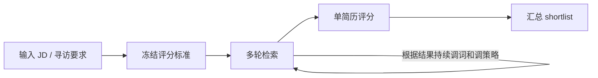

# Meeting Notes

### 1.我们现在是在做什么
根据JD寻找最合适的简历的Agent。
场景：在CTS系统，或者三网，像人类一样使用关键词检索，评估，更换关键词，再检索，评估的多轮循环过程。目前实验基于CTS系统。
### 2.目前的进度和状态
#### 1).编排策略


- 评分标准会先冻结，后面即使搜索词调整，评分的尺子也不变。
- 搜索策略会根据每轮结果不断微调，但不会因为“怎么搜”而改变“怎么判断人”。
- 关键词不是一次定死的。系统会根据每轮搜索结果，保留有效词、替换噪音词，并补充从高分简历中提炼出的共性词，逐步把搜索范围从“搜得到”收敛到“搜得准”。
- 整个流程是在模拟猎头真实工作中的多轮检索、判断、复盘和再检索过程。
#### 2).评分策略
这里讲的是单份简历怎么打分，不是整次 agent 效果评估。

当前实现里，`M`、`P`、`R` 和 `fit_bucket` 不是代码里按固定公式硬算出来的，而是 scoring 模型在固定评分标准下，先看证据，再给判断。

这里的判断顺序是：

1. 先只看两样输入：冻结后的 `ScoringPolicy`，以及这一份简历的结构化摘要。
2. 先盘点证据：哪些 `must-have` 有明确支持，哪些 `preferred` 有支持，哪些地方存在缺证、冲突或排除信号。
3. 先判 `fit_bucket`，也就是先做“留不留在池子里”的顶层判断：
   - `fit`：关键 `must-have` 基本有证据，而且没有明显致命冲突或排除项。
   - `not_fit`：关键 `must-have` 缺失，或存在明确硬冲突 / 排除项，或整体证据太弱。
4. 再写三个局部分：
   - `M` = `must_have_match_score`，看关键要求匹配得怎么样。
   - `P` = `preferred_match_score`，看加分项匹配得怎么样。
   - `R` = `risk_score`，看当前判断还有多大风险，越高表示风险越大。
5. 最后再收束成 `overall_score`。它不是单独自由发挥，也不能和前面的判断矛盾；如果前面已经判断为 `not_fit`，总分就不能高得像通过了一样。

当前 scoring prompt 还给了一个分数带宽，方便约束评分风格：

- `90-100`：高度匹配
- `75-89`：强匹配
- `60-74`：有匹配也有明显不足
- `40-59`：边缘 / 存疑
- `<40`：弱匹配

一句话概括：先看证据，先判 `fit_bucket`，再给 `M/P/R`，最后收束成 `overall_score`。缺失证据不会被默认当成“有”，而是会提高风险。

这部分最希望猎头帮助我们校正的是：哪些条件应该被视为硬门槛，哪些条件更适合视为可放宽项，哪些信号一旦出现就值得给出高风险提示。
#### 3).judge策略
这里讲的是整次 agent 检索结果如何评估，而不是单份简历怎么打分。

对最终 Top 10 中第 `i` 份简历，judge 给出相关性分数：

$$
J_i \in \{0,1,2,3\}
$$

其中：

- `3`：非常匹配，值得直接推进
- `2`：比较匹配，值得人工复核
- `1`：部分相关，但偏弱
- `0`：不相关

定义 gain 为：

$$
G_i = J_i
$$

则：

$$
DCG@10 = \sum_{i=1}^{10}\frac{G_i}{\log_2(i+1)}
$$

$$
IDCG@10 = \sum_{i=1}^{10}\frac{3}{\log_2(i+1)}
$$

$$
nDCG@10 = \frac{DCG@10}{IDCG@10}
$$

$$
P@10 = \frac{1}{10}\sum_{i=1}^{10}\mathbf{1}(J_i \ge 2)
$$

$$
TotalScore = 0.3 \cdot nDCG@10 + 0.7 \cdot P@10
$$

这里的业务含义是：`P@10` 看 Top 10 里有多少份简历值得继续看，`nDCG@10` 看真正好的简历有没有被排在更前面，`TotalScore` 则更偏重“这次到底有没有找到可用候选人”，其次才是排序是否足够漂亮。

当前 `judge` 和在线 `scoring` 是分开的：在线 `scoring` 负责搜索过程中的单简历打分，离线 `judge` 负责对最终 Top 10 做独立复核。当前仓库默认本地配置里，`judge` 使用的是 `openai-responses:gpt-5.4`；提示词的原则是只看 JD、补充 notes 和冻结后的简历快照，不参考其他候选人，不对缺失信息做主观补全，并按固定的 0-3 标准给出分数和简短依据。

下面是当前仓库里 `judge` prompt 的完整中文翻译版：

```text
# 简历对评判器

## 角色

对一份岗位描述、可选的寻访说明，以及一份 CTS 简历快照组成的配对进行评判。

## 目标

只基于冻结后的 CTS 简历快照，为这组配对给出且仅给出一个相关性分数。

## 硬规则

- 只使用提供的 `JOB_DESCRIPTION`、可选的 `NOTES` 和 `RESUME_SNAPSHOT`。
- 把 CTS 快照当作事实来源，不要脑补缺失事实。
- 分数定义：
  - `3`：非常强匹配。会直接推进。
  - `2`：比较扎实的匹配。值得复核。
  - `1`：弱相关或部分相关。
  - `0`：不相关。
- 证据缺失应该拉低分数。
- 不要和市场常态或其他简历做比较。
- 不要输出隐藏推理过程。

## 输出风格

- `rationale` 保持简短、客观。
- `rationale` 必须落在简历快照中支持该分数的字段上。
```

这部分最希望猎头帮助我们校正的是：0/1/2/3 这四档分数，是否真的对应你们现实里的推进动作，以及 Top 10 里“值得继续看”的比例大概应该是什么水平。

### 3.后续的规划
#### 1).在现有 CTS 环境下提升搜索效果
在现有 CTS 环境里，下一步重点是让系统更会“越找越准”。包括从已找到的高分简历中提炼共性关键词、减少无效调词、以及加入 `Query by example`，也就是如果出现一份很匹配的简历，即使人选最后没成，也能基于这份样本继续找相似简历，让搜索更像猎头“先找到一个好样本，再顺藤摸瓜”的过程。

#### 2).升级更强的检索表达与策略能力
目前 CTS 只支持交集语法，后续迁移到三网后，会把布尔查询逐步加入 agent 的检索能力中，让系统能更准确地表达“必须有”和“最好有”的组合关系。更系统的搜索策略优化也会作为后续技术路线推进，例如 `MCTS`、`UCB`、`GA-lite` 等方向，但这一部分我们会优先围绕用户价值来推进，而不是先堆技术复杂度。
### 4.用户需求校正

1.大家的实际检索简历的流程是这样的吗？根据JD确定关键词，找简历，根据找的结果，再改关键词，再找。真实的简历搜索匹配的过程是怎么样的？大家有什么建议？
2.大家如何判断一个简历是否匹配？大家的经验中，JD中的地点，学历，院校，经验，性别，年龄。哪些过滤器是如果JD中写了就必须匹配的硬性指标，哪些可以适当放宽？技能要求怎么判断主次？特别是不熟悉的领域。
3.评分策略有什么建议？
4.judge策略有什么建议？
