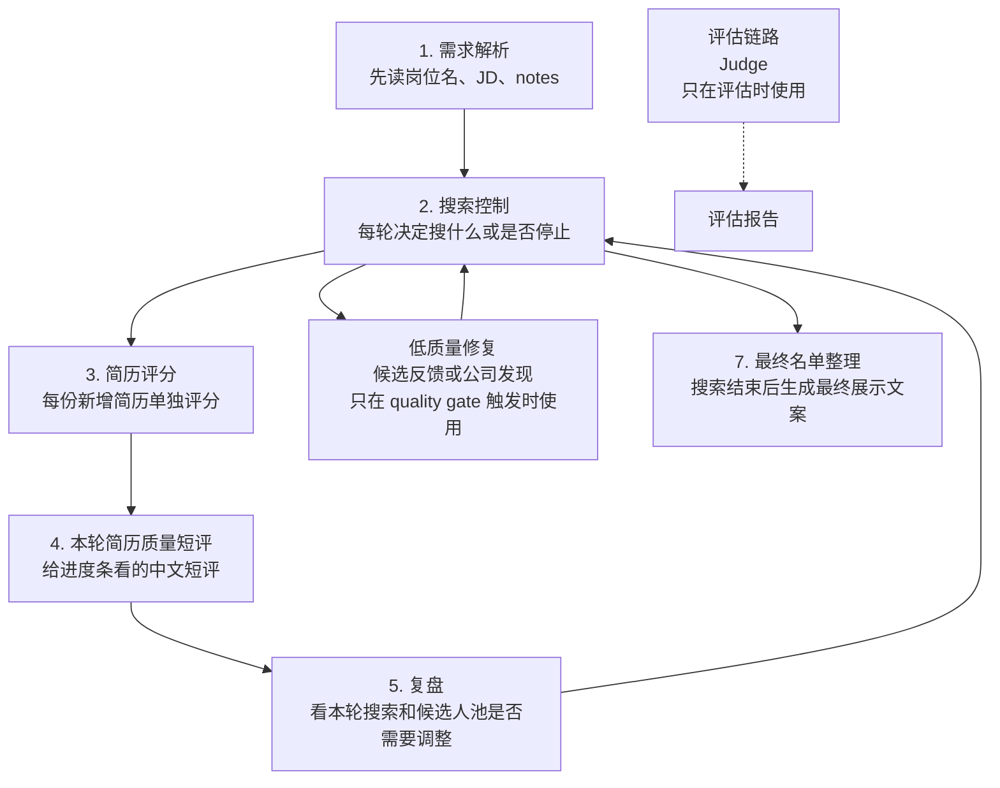
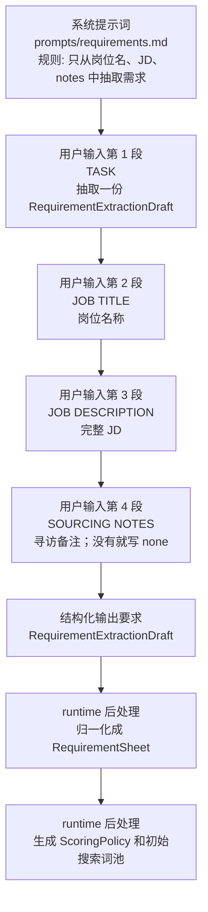
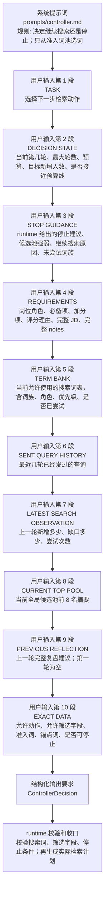
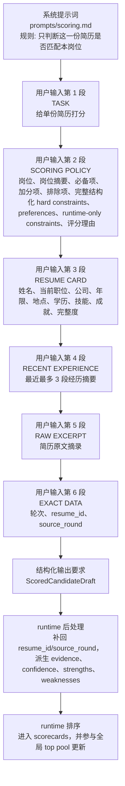
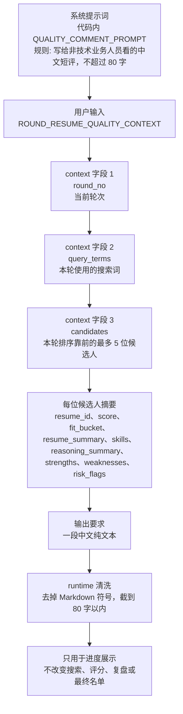
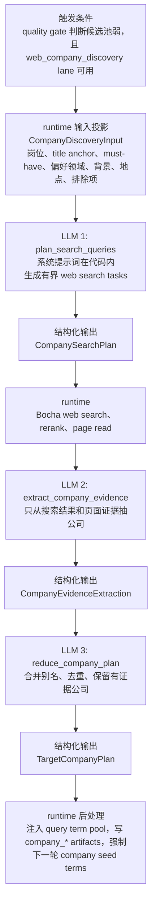
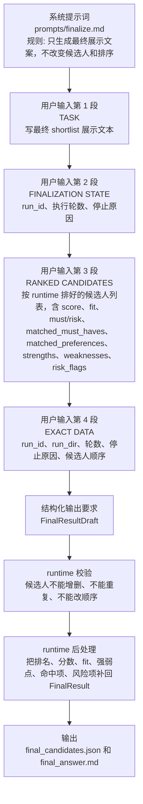
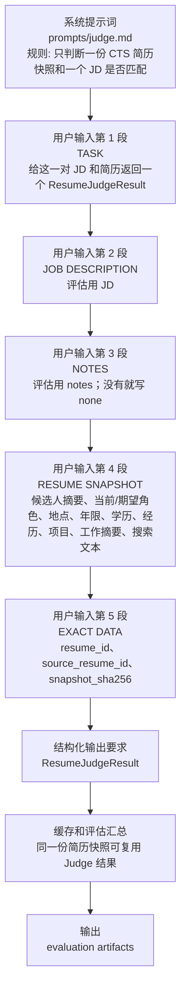
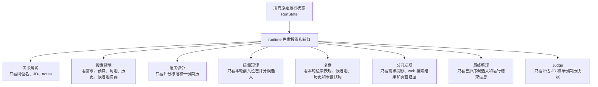

# LLM Context 组成

本文按当前代码里的实际 LLM 调用点说明 context 是怎么拼起来的。

阅读方式：

- 每张图都是从上到下读。
- 最上面是系统提示词，也就是这个 LLM 的长期角色和规则。
- 中间是本次调用传进去的内容，顺序就是 prompt 拼接顺序。
- 最下面是模型必须返回的结构，以及 runtime 拿到结果后怎么用。

主运行链路是：

`Judge` 不参与正常找人流程，只在打开评估流程时给候选人打评估标签。

低质量修复不是每轮都会发生。当前 candidate feedback 路径是 runtime 确定性提取；web company discovery 路径会额外调用 LLM 来生成 web 搜索任务、抽取公司证据、合并公司计划。

---

## 1. 需求解析

大白话：

这一步像招聘顾问第一次读需求。它只看岗位名称、JD 和补充备注，不看搜索结果、不看候选人、不看后面任何评分。它的任务是把“这个岗位到底要什么人”抽成一张需求表，并顺手给后面的搜索和评分准备基础词库。

业务上可以理解成：先把客户需求翻译成系统能执行的招聘 brief。

---

## 2. 搜索控制

大白话：

这一步像“每轮搜索前的调度员”。它会看岗位需求、预算、之前搜过什么、上一轮效果如何、当前候选池质量如何，然后决定下一轮继续搜什么，或者是否可以收工。

它会看到上一轮 reflection 的完整建议字段，但 reflection 只有建议权。Controller 需要在 `response_to_reflection` 中说明采纳、部分采纳或拒绝。Runtime 只执行 Controller 的结构化决定，并校验查询词、筛选字段和停止条件。

业务上可以理解成：每一轮开搜前，先决定“这次用什么关键词组合，是否该继续扩大或收窄”。

---

## 3. 简历评分

大白话：

这一步像“单份简历评审”。Scoring prompt 会包含完整的结构化 hard constraints、preferences，以及本轮未能投到 CTS 的 runtime-only constraints。每个评分调用仍然只看一份简历和同一套岗位评分标准，不看其他候选人。这样可以避免模型因为候选人之间互相比较而改变标准。

模型只负责判断这份简历的匹配度、分数、风险、命中的必备项和缺失项。候选人的最终排序、证据汇总、强弱点展示字段由 runtime 再统一整理。

业务上可以理解成：每份简历先单独过一遍岗位匹配打分，之后系统再统一排队。

---

## 4. 本轮简历质量短评

大白话：

这一步只是给用户界面或进度回调用的“本轮质量一句话”。它看本轮已经打好分的前几位候选人，然后写一句类似“本轮候选人整体较贴合，主要强在 Python 和检索经验，但有年限风险”的短评。

它不参与决策。短评生成失败也不会改变候选人评分、搜索策略或最终结果。

业务上可以理解成：跑流程时给人看的即时旁白，不是招聘决策本身。

---

## 5. 复盘

```mermaid
flowchart TD
    A["系统提示词<br/>prompts/reflection.md<br/>规则: 复盘本轮结果，给关键词、筛选和停止建议"] --> B["用户输入第 1 段<br/>TASK<br/>返回结构化关键词/筛选建议、复盘理由和停止建议"]
    B --> C["用户输入第 2 段<br/>REQUIREMENTS<br/>岗位、完整需求表、完整 JD、完整 notes"]
    C --> D["用户输入第 3 段<br/>ROUND RESULT<br/>本轮请求数、原始候选数、新增数、缺口、抓取次数、耗尽原因、适配器备注"]
    D --> E["用户输入第 4 段<br/>CURRENT QUERY<br/>本轮搜索词、keyword query、非地点筛选、搜索理由"]
    E --> F["用户输入第 5 段<br/>TERM BANK<br/>当前 runtime 搜索词池"]
    F --> G["用户输入第 6 段<br/>SEARCH ATTEMPTS<br/>最多前 8 次抓取尝试的原始数、新增数、重复数、耗尽原因"]
    G --> H["用户输入第 7 段<br/>SENT QUERY HISTORY<br/>最近最多 8 条已发查询"]
    H --> I["用户输入第 8 段<br/>TOP CANDIDATES<br/>当前全局候选池前 8 名摘要"]
    I --> J["用户输入第 9 段<br/>DROPPED CANDIDATES<br/>本轮被挤出候选池的最多 5 人"]
    J --> K["用户输入第 10 段<br/>SCORING FAILURES<br/>评分失败摘要，通常为空"]
    K --> L["用户输入第 11 段<br/>UNTRIED ADMITTED TERMS<br/>还没试过的准入搜索词"]
    L --> M["用户输入第 12 段<br/>EXACT DATA<br/>轮次、当前查询词、筛选字段、候选人 id、停止建议字段名"]
    M --> N["结构化输出要求<br/>ReflectionAdviceDraft"]
    N --> O["runtime 后处理<br/>生成 ReflectionAdvice，必要时压制过早停止建议"]
    O --> P["给下一轮 controller 使用<br/>作为上一轮复盘建议"]
```

大白话：

这一步像“每轮结束后的复盘会”。它主要看需求、当前 runtime 词池、这一轮搜得怎么样、有没有新增、缺口大不大、用了哪些词、当前前排候选人质量如何、哪些人被挤出候选池，然后建议下一轮保留、激活、降权或放弃哪些已有搜索词。

注意：Reflection 不直接修改 `query_term_pool`，也不决定下一轮 query。它只输出关键词、筛选和停止建议。下一轮 Controller 会看到这些建议，并决定是否采纳。

业务上可以理解成：它不直接开搜，只告诉下一轮调度员“刚才这一轮哪里有效，哪里需要调整”。

---

## 6. 公司发现 Rescue

大白话：

这一步像“候选池太弱时，先去外部网页找相似来源公司”。它不是正常 controller 的替代品，只在 rescue lane 选中 `web_company_discovery` 时运行。

第一段 LLM 只负责把岗位需求投影成少量 web 搜索任务，不直接下公司结论。runtime 用这些 query 调 web search provider，必要时 rerank 并读页面。第二段 LLM 只从搜索结果和页面证据里抽公司候选。第三段 LLM 再把证据公司合并、去重，形成可注入搜索词池的 `TargetCompanyPlan`。

业务上可以理解成：当 CTS 常规关键词搜不出足够好的人时，先找“可能产出这类人才的公司”，再把这些公司作为下一轮搜索线索。

当前 candidate feedback rescue 不走 LLM；它从已评分候选人和负样本里确定性提取一个安全反馈词，写入 `candidate_feedback_*` artifacts。

---

## 7. 最终名单整理

大白话：

这一步像“把已排好的候选人名单写成客户能看的话”。它拿到的候选人顺序已经由系统决定，模型只能为每个人写匹配摘要和入选理由。

它不能新增候选人，不能删除候选人，也不能调整排名。排名、分数、风险、强弱点这些结构化事实由 runtime 保留。

业务上可以理解成：最后做展示包装，不重新做招聘判断。

---

## 8. 评估 Judge

大白话：

这一步是离线评估用的裁判。它把 JD 和某一份 CTS 简历快照放在一起，给出 0 到 3 的相关性分数和简短理由，用来评估搜索结果质量。

它不会影响正常运行时的搜索、评分或最终名单。正常找人流程即使不开评估，也会照常完成。

业务上可以理解成：跑完之后拿来衡量“系统找得准不准”的外部打标员。

---

## 哪些信息不会直接交给某个 LLM

大白话：

系统不是把所有东西一股脑塞给每个模型。每个 LLM 只拿自己当前任务需要的那一小份信息。这样做的好处是职责更清楚，也更容易排查问题：需求解析负责读需求，控制器负责下一轮搜什么，评分器负责单份简历，复盘负责总结本轮，最终整理负责写展示文案。

如果要查某次运行的真实输入，可以从 run 目录里的 call snapshot 和对应 context artifact 开始看；其中 call snapshot 主要保存 hash、字符数、摘要和 artifact 引用，完整内容通常在引用的 artifact 或 prompt snapshot 里。
