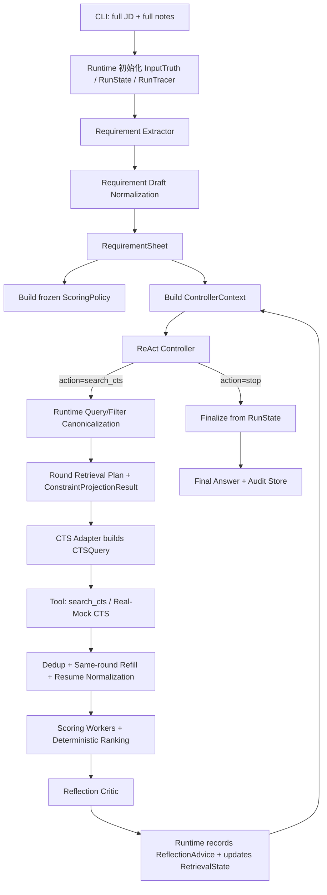
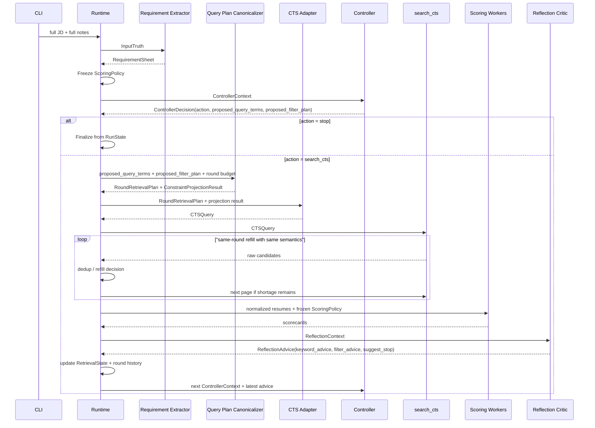

# cv-match v0.2 设计文档

## 0. 文档信息

- 版本：`v0.2`
- 状态：`design / proposed`
- 文档目标：在保留 `single-controller ReAct workflow` 主骨架的前提下，把检索侧从“全量关键词拼接 + 模糊 filter 投影”升级为“固定业务真相 + 轮次预算驱动的 query planning + 结构化 constraint projection”。
- 文档语言约定：正文使用中文，关键术语保留英文，例如 `Controller`、`Reflection`、`RequirementSheet`、`RunState`、`Context Builder`、`Round Retrieval Plan`、`Audit Store`。

---

## 1. 不变的业务要求（Business Invariants）

以下业务要求在 `v0.2` 中视为固定真相，不允许在实现阶段被 prompt 或局部模块随意改写。

### 1.1 输入真相

每次运行的业务输入仍然只有两段原始文本：

1. `JD`
2. `notes`（即寻访须知）

它们构成整个 run 的需求真相来源。后续任何检索、评分、reflection、finalize 都不得脱离这两段文本定义岗位要求。

### 1.2 Keyword 轮次规则

`keyword` 的业务规则如下：

1. 第 `N` 轮发送给 CTS 的查询词数量必须是 `N + 1`。
2. 因此第 `1` 轮固定发送 `2` 个查询词。
3. `keyword` 可以逐轮新增，但每轮真正发给 CTS 的只是一小组“本轮查询词”，不是把历史全部词全量拼上。
4. 不同查询词之间使用空格拼接。
5. 如果某个查询词内部包含空格，则外层必须使用双引号包裹。
6. 如果查询词内部包含双引号，则必须转义后再序列化。

示例：

```text
python react
python "resume matching" react
python "Pydantic AI" "resume matching"
```

### 1.3 Filter 业务字段

`v0.2` 必须把以下业务字段视为标准检索/约束槽位：

- 地点
- 学历要求
- 院校类型
- 经验要求
- 性别要求
- 年龄要求
- 公司名称

这些字段的业务规则如下：

1. 它们是“应抽尽抽”的字段，不是“必须非空”的字段。
2. 只要 `JD` 或 `notes` 中有明确要求，就必须提取并结构化，写入业务真相。
3. 如果对应字段为空，不得阻断流程。
4. `location` 是特例：
   - 一旦在 `JD` 或 `notes` 中出现，就必须进入业务真相
   - `hard_constraints.locations` 保存完整允许地点集合
   - `preferences.preferred_locations` 只在多地点且有明确优先级时使用
   - `Runtime` 负责把地点语义展开成每轮 `location_execution_plan`
5. `Controller` 与 `Reflection` 都不直接拥有 `location` filter 的增删权；地点执行顺序和预算分配由 runtime 决定。
6. 除 `location` 之外，其他 filter 即使来自 `JD` 或 `notes`，`Controller` 也可以在后续轮次根据检索效果决定保留、取消或新增。
7. `经验要求` 与 `年龄要求` 必须先抽成数值语义，再考虑是否映射到 CTS 的枚举字段。
8. 发给 CTS 的枚举类值，必须优先使用 CTS 客户端可见的枚举词作为 canonical label，而不是自由文本。
9. 如果 CTS 协议层最终需要其他格式，例如 integer code，则由 `CTS Adapter` 负责把 canonical label 转成协议值。
10. 如果某个值不在允许的客户端枚举词集合中，则默认不应直接发送给 CTS，除非该字段明确支持 `自定义`。

### 1.4 Context 组装原则

各环节的 `context` 必须由 `Runtime` 按需自动拼装：

- 不允许无边界地把全部状态塞进 prompt
- 不允许让 prompt 自己“猜应该看哪些信息”
- 不允许漏掉当前环节完成任务所必需的信息

### 1.5 Reflection 权责

`self-reflection` 在 `v0.2` 中是 `Controller` 的 `critic / evaluator`，不是 query 的最终决策者：

- 它负责判断当前 query 是否有效
- 它负责提出下一轮 query 应如何调整的结构化建议
- 它负责评价当前 filter 组合是否过严、过松、缺失或无效
- 它必须看到完整 `JD` 和完整 `notes`
- 它不能脱离完整需求真相只靠截断摘要做评论
- 它不能替代 `Controller` 做最终 keyword 决策

---

## 2. v0.1 的现状与问题

`v0.2` 不是凭空重写，而是基于 `v0.1` 的运行真相进行修正。

### 2.1 当前系统真相

在 `v0.1` 当前实现中：

1. `bootstrap_search_strategy()` 会从 `JD + notes` 中抽取大量 `must_have_keywords / preferred_keywords`。
2. `build_cts_query_from_strategy()` 默认把 `must_have + preferred` 全量拼成一次 CTS `keyword_query`。
3. `Reflection` 会继续往 `preferred_keywords` 里 append 新词。
4. `same-round refill` 不会改变 query 语义，只会分页补拉。
5. `soft_filters` 与 `hard_filters` 在 live CTS payload 中都会被直接塞进 CTS 字段，CTS 本身并不知道“soft”语义。
6. `scoring_policy` 在 run 开始时就被冻结，后续 query 调整不影响评分标尺。

### 2.2 暴露出来的核心问题

这套实现会带来几个结构性问题：

1. 首轮 query 可能直接携带十几个甚至几十个词，不符合实际招聘检索习惯。
2. 随着 reflection 继续追加词，query 只会越来越长，不会自然收敛。
3. “查询词池”与“本轮真正发送给 CTS 的词”没有严格区分。
4. `soft filter` 这个词在业务上有意义，但在 CTS 协议层没有原生语义，导致 mock/live 不一致。
5. reflection 当前看不到完整 `JD` 与完整 `notes`，只能看轮次摘要，不足以承担 query evolution 的主要责任。
6. context 目前是分散拼接的，没有正式的 `Context Builder` 规范。

---

## 3. v0.2 设计结论摘要

本版本的核心结论如下：

1. 保留 `single-controller ReAct workflow` 的总架构，不引入 `multi-agent`。
2. 引入 `RequirementSheet`，作为从完整 `JD + notes` 中抽取出的结构化业务真相。
3. 检索侧不再把“完整关键词池”直接等价为“本轮 CTS query”。
4. 引入 `Round Retrieval Plan`，每轮 CTS 检索都必须由 runtime 按轮次预算构建。
5. `keyword` 的发送数量由 runtime 硬约束为第 `N` 轮发送 `N + 1` 个词。
6. 若词内部含空格，则 `keyword_query` 序列化时必须加双引号。
7. 原 `soft filter` 概念在协议层废弃，改为更清晰的：
   - `hard_constraints`
   - `preferences`
8. 只有被安全映射到 CTS 的 `hard_constraints` 才能成为 CTS 原生 filter。
9. `preferences` 不再直接作为 CTS filter 发送，而是影响：
   - query term selection
   - scoring
   - ranking
   - reflection
10. `Controller` 是每一轮 query terms 的唯一 owner，包括第 `1` 轮，并且必须看到完整 `JD + notes + RequirementSheet`。
11. `Controller` 同时负责每轮非地点 filter 组合决策；地点集合来自 `RequirementSheet`，地点执行计划由 runtime 生成。
12. `Reflection` 是 `Controller` 的 `critic`，必须看到完整 `JD + notes + RequirementSheet`，但只输出建议，不直接决定 query terms 或最终 filter 组合。
13. `Context Builder` 成为一等组件，由 runtime 为不同阶段自动拼装最小且完整的上下文。

一句话概括：

> `cv-match v0.2` 是一个以 `RequirementSheet` 为业务真相、以 `Controller-owned query decisions + Reflection-as-critic` 为决策机制、以 `Runtime-enforced query budget` 为执行边界的单控制器系统。

---

## 4. 顶层架构（High-level Architecture）

### 4.1 组件清单

| 组件 | 类型 | 是否 LLM | 职责 |
| --- | --- | --- | --- |
| `CLI` | interface | 否 | 读取 `JD + notes`，启动 run |
| `Runtime` | workflow controller | 否 | 执行全流程、控制预算、写审计 |
| `Requirement Extractor` | structured processor | 是 | 从完整输入抽取 `RequirementExtractionDraft`，再经 deterministic normalization 生成 `RequirementSheet` |
| `Query Plan Canonicalizer` | deterministic planner | 否 | 对 `Controller` 提议的 query terms 与 filter plan 做预算校验、规范化，并构建 `Round Retrieval Plan` |
| `ReAct Controller` | agent | 是 | 决定执行 `search_cts` 或停止，并决定本轮 query terms |
| `search_cts` | tool | 否 | 调用 CTS 检索 |
| `CTS Adapter` | adapter | 否 | 把 `Round Retrieval Plan` 投影为 `CTSQuery`，并做协议级字段映射 |
| `Resume Normalizer` | processor | 否 | 统一简历结构 |
| `Resume Scorer` | LLM worker | 是 | 单简历评分 |
| `Reflection Critic` | LLM step | 是 | 评估轮次结果并向 `Controller` 提供下一轮 query / filter 调整建议 |
| `Context Builder` | deterministic builder | 否 | 给各阶段自动拼装最小完备上下文 |
| `RunTracer` | infra | 否 | 写 `trace.log`、`events.jsonl` 和审计产物 |

### 4.2 顶层流程图



### 4.3 核心设计原则

1. 完整需求真相只来自 `JD + notes`，不是来自检索历史。
2. query budget 是 runtime 规则，不是 prompt 建议。
3. `keyword pool` 与 `round query terms` 必须明确区分。
4. `hard_constraints` 与 `preferences` 是业务语义，不是 CTS 原生语义。
5. CTS 只接收被 runtime 证明安全的 query 和 filter 投影。
6. `Controller` 必须拥有足够上下文来决定 query terms，`Reflection` 必须拥有足够上下文来批判 query quality，但二者都不能改写评分标尺。
7. scoring policy 必须稳定，不能随着每轮检索词波动而漂移。
8. `RunState` 是在线唯一真相源，其他给 LLM 的输入都只是 context projection。
9. context 必须由系统按需组装，而不是交给模型自由选择。

---

## 5. 业务真相模型（Business Truth Model）

### 5.1 为什么要引入 `RequirementSheet`

`v0.1` 的一个问题是：需求抽取、query term、评分 must-have、CTS filter 投影混在一个 `SearchStrategy` 里。

这会导致：

- query 过长
- query 与 scoring 不一致
- filter 语义不清
- reflection 缺少稳定的需求真相参考

因此 `v0.2` 必须先把“岗位需求真相”独立为 `RequirementSheet`。

### 5.2 `InputTruth`

```python
class InputTruth(BaseModel):
    jd: str
    notes: str
    jd_sha256: str
    notes_sha256: str
```

特点：

- 保存完整原始输入
- 是 reflection 的基础上下文来源
- 不直接原样发给 CTS

### 5.3 `RequirementSheet`

```python
class RequirementSheet(BaseModel):
    role_title: str
    role_summary: str
    must_have_capabilities: list[str]
    preferred_capabilities: list[str]
    exclusion_signals: list[str]
    hard_constraints: HardConstraintSlots
    preferences: PreferenceSlots
    initial_query_term_pool: list[QueryTermCandidate]
    scoring_rationale: str
```

解释：

- `must_have_capabilities` 用于稳定评分标准
- `preferred_capabilities` 用于偏好和加分
- `exclusion_signals` 用于负向证据识别
- `hard_constraints` 表示业务上的强约束
- `preferences` 表示业务上的偏好，不再叫 `soft_filters`
- `initial_query_term_pool` 是“候选查询词池”，不是首轮 CTS query 本身

### 5.3.1 `RequirementDigest`

`RequirementDigest` 是给 `Controller` 使用的需求摘要视图，不是新的真相来源。

```python
class RequirementDigest(BaseModel):
    role_title: str
    role_summary: str
    top_must_have_capabilities: list[str]
    top_preferences: list[str]
    hard_constraint_summary: list[str]
```

要求：

1. `RequirementDigest` 必须可从 `RequirementSheet` 重建。
2. 它主要服务于 `ControllerContext`，也可用于 trace 与 UI 摘要。
3. 它不允许丢掉 stop/go 判断所需的主轴要求。

### 5.4 `HardConstraintSlots`

```python
class HardConstraintSlots(BaseModel):
    locations: list[str] = []
    school_names: list[str] = []
    degree_requirement: DegreeRequirement | None = None
    school_type_requirement: SchoolTypeRequirement | None = None
    experience_requirement: ExperienceRequirement | None = None
    gender_requirement: GenderRequirement | None = None
    age_requirement: AgeRequirement | None = None
    company_names: list[str] = []
```

约束：

1. 所有字段都允许为空。
2. 为空表示“未明确提出”，不是“匹配失败”。
3. 只有在 `JD/notes` 明确要求时才填充。
4. `locations` 一旦抽出，表示允许地点集合；它不再作为 controller-managed pinned filter 处理。

### 5.5 `PreferenceSlots`

```python
class PreferenceSlots(BaseModel):
    preferred_locations: list[str] = []
    preferred_companies: list[str] = []
    preferred_domains: list[str] = []
    preferred_backgrounds: list[str] = []
    preferred_query_terms: list[str] = []
```

设计意图：

- `PreferenceSlots` 承载招聘偏好
- 它们不直接成为 CTS 阻断 filter
- 它们在 query term planning、scoring、ranking、reflection 中发挥作用

### 5.5.2 Filter ownership

`v0.2` 对 filter 的 ownership 规定如下：

- `Requirement Extractor`
  - 负责把 `JD + notes` 中出现的 filter 事实抽成 `RequirementExtractionDraft`
- `Controller`
  - 负责决定本轮真正发送哪些非地点 filter
- `Reflection`
  - 只能评价 filter 是否过严、过松、缺失或无效
  - 只能给建议，不能直接改写最终 filter 计划
- `Runtime`
  - 负责地点执行计划、filter 校验和枚举合法性

### 5.5.1 约束值对象

```python
class DegreeRequirement(BaseModel):
    canonical_degree: str
    raw_text: str
    pinned: bool = False

class SchoolTypeRequirement(BaseModel):
    canonical_types: list[str]
    raw_text: str
    pinned: bool = False
```

说明：

- `canonical_degree` 与 `canonical_types` 是业务归一化结果
- 是否可投影到 CTS 枚举，取决于本地 mapping table，而不取决于抽取本身

### 5.5.3 Location execution ownership

`location` 不再走 `pinned_filters` 语义，而是拆成三层：

1. `hard_constraints.locations`：完整允许地点集合
2. `preferences.preferred_locations`：多地点下的优先级顺序
3. `location_execution_plan`：runtime 按 `round_no + target_new` 动态生成的本轮执行计划

结果是：

1. `Controller` 不再通过 `proposed_filter_plan` 决定 location。
2. `Reflection` 只能在 prose 中评价地点覆盖，不返回 `location` filter advice。
3. runtime 对每个城市单独发 CTS 请求，并负责预算分配、余数轮转和续页。

### 5.6 为什么不再使用 `soft filter`

`v0.2` 明确废弃 `soft filter` 这个术语，原因如下：

1. `soft filter` 是业务语义，不是 CTS 协议语义。
2. 当前 CTS payload 不区分 soft/hard，直接发送会导致 live 端误解。
3. mock 与 live 的 soft 语义不一致，会制造错误安全感。
4. 招聘业务真正想表达的是“偏好”而不是“协议级过滤器”。

因此：

- 业务层保留“强约束 vs 偏好”
- 协议层只保留“是否发送为 CTS 原生字段”

---

## 6. Keyword 设计（Keyword Lifecycle）

### 6.1 关键结论

`v0.2` 中必须明确区分三类概念：

1. `capabilities`
2. `query term pool`
3. `round query terms`

它们不再混为一谈。

### 6.2 `QueryTermCandidate`

```python
class QueryTermCandidate(BaseModel):
    term: str
    source: Literal["jd", "notes", "reflection"]
    category: Literal["role_anchor", "domain", "tooling", "expansion"]
    priority: int
    evidence: str
    first_added_round: int
    active: bool = True
```

说明：

- `term` 是一个“逻辑查询词”
- `priority` 用于 deterministic selection
- `category` 用于保证不同类型词的覆盖
- `active=False` 表示该词已被 reflection 判定为低价值或错误方向

### 6.3 首轮 query 规则

首轮不再把 `initial_query_term_pool` 全量发给 CTS。

首轮必须满足：

1. 发送词数固定为 `2`
2. 优先选择两个最强 `role_anchor`
3. 这两个词应能定义岗位主轴，而不是把 domain、工具、偏好、排除项一股脑打包

示例：

- 合理：`python react`
- 合理：`python "resume matching"`
- 不合理：`python react tracing logging openapi pydantic`

### 6.4 第 N 轮 query 规则

定义：

```python
keyword_budget(round_no) = round_no + 1
```

因此：

- Round 1: `2`
- Round 2: `3`
- Round 3: `4`
- Round 4: `5`
- Round 5: `6`

运行时要求：

1. 每轮必须严格发送 `keyword_budget(round_no)` 个查询词。
2. 这些词来自当前可用的 `query term pool`。
3. 不能把历史所有词再次全量拼接。
4. 不能因为 prompt 想多发几个就突破 budget。

### 6.5 Query Term 序列化规则

`CTSQuery.keyword_query` 的序列化必须是 deterministic 的。

推荐实现：

```python
def serialize_keyword_query(terms: list[str]) -> str:
    serialized: list[str] = []
    for term in terms:
        clean = normalize_term(term)
        if " " in clean or "\t" in clean:
            clean = clean.replace("\\", "\\\\").replace('"', '\\"')
            serialized.append(f'"{clean}"')
        else:
            serialized.append(clean)
    return " ".join(serialized)
```

约束：

1. `terms` 列表中每个 term 是一个逻辑词项。
2. term 内部如果包含空格，最终 `keyword_query` 中必须加双引号。
3. term 之间只能使用单个空格分隔。
4. 运行时必须同时保留：
   - `query_terms: list[str]`
   - `keyword_query: str`

### 6.6 Controller 与 keyword ownership

`v0.2` 中，所有轮次的 query terms owner 都是 `Controller`，包括第 `1` 轮。

职责划分如下：

- `Requirement Extractor`
  - 生成初始 query term pool
- `Controller`
  - 读取完整 `JD + notes + RequirementSheet + round state + reflection advice`
  - 决定执行 `search_cts` 或 `stop`
  - 决定本轮 `proposed_query_terms`
- `Reflection`
  - 评估上一轮 query 的效果
  - 给出新增、保留、降权、移除 query terms 的建议
- `Query Plan Canonicalizer`
  - 校验 `Controller` 提议是否满足轮次 budget
  - 生成最终 `Round Retrieval Plan`

结论：

1. 第一轮不需要单独找 owner，天然由 `Controller` 决定。
2. 后续轮次也是 `Controller` 决定，只是会参考 `Reflection` 的建议。

### 6.7 Reflection 输出中的 keyword advice

```python
class ReflectionKeywordAdvice(BaseModel):
    suggested_add_terms: list[str] = []
    suggested_keep_terms: list[str] = []
    suggested_deprioritize_terms: list[str] = []
    suggested_drop_terms: list[str] = []
    critique: str
```

规则：

1. `Reflection` 不是直接返回完整 CTS query。
2. `Reflection` 返回的是“对下一轮 query 的建议”。
3. `Controller` 必须参考这些建议，但可以接受或拒绝。
4. `Runtime` 需要审计记录 `Reflection` 的建议与 `Controller` 的最终决策。

### 6.7.1 Reflection 输出中的 filter advice

```python
class ReflectionFilterAdvice(BaseModel):
    suggested_keep_filter_fields: list[str] = []
    suggested_drop_filter_fields: list[str] = []
    suggested_add_filter_fields: list[str] = []
    critique: str
```

规则：

1. `Reflection` 可以评价 filter 是否过严、过松或缺失。
2. `Reflection` 可以建议 controller 取消或新增非地点 filter。
3. `Reflection` 可以在 prose 中评价地点覆盖，但不返回 `location` filter advice。

### 6.8 Query 决策与 canonicalization

query term 的选择由 `Controller` 完成，但必须经过 runtime 的 deterministic canonicalization。

推荐流程：

1. `Controller` 输出 `proposed_query_terms`
2. `Runtime` 做：
   - 去空白
   - 大小写与别名归一化
   - 去重
   - budget 校验
   - deterministic serialization
3. 若 budget 不符，优先触发 controller repair；若仍不符，应直接 fail-fast

示意算法：

```python
def canonicalize_controller_query_terms(proposed_terms, round_no):
    budget = round_no + 1
    terms = dedup_casefold(normalize_term(item) for item in proposed_terms)
    if len(terms) != budget:
        raise QueryBudgetViolation(f"expected {budget} query terms, got {len(terms)}")
    return terms
```

设计意图：

1. query 决策权保持在 `Controller`
2. 预算和协议正确性保持在 `Runtime`
3. 防止“模型自由发挥”破坏轮次约束

### 6.9 `RetrievalState`

```python
class RetrievalState(BaseModel):
    current_plan_version: int
    query_term_pool: list[QueryTermCandidate]
    sent_query_history: list[SentQueryRecord]
    reflection_keyword_advice_history: list[ReflectionKeywordAdvice]
    reflection_filter_advice_history: list[ReflectionFilterAdvice]
    last_projection_result: ConstraintProjectionResult | None = None
```

说明：

- `RetrievalState` 是运行时检索演化真相
- 它不是评分真相，也不是完整业务真相
- 它记录 query 是如何随轮次演进的

### 6.10 `RoundRetrievalPlan`

```python
class RoundRetrievalPlan(BaseModel):
    plan_version: int
    round_no: int
    query_terms: list[str]
    keyword_query: str
    projected_cts_filters: dict[str, str | int | list[str]]
    runtime_only_constraints: list[RuntimeConstraint]
    target_new: int
    rationale: str
```

强约束：

1. `query_terms` 长度必须等于 `round_no + 1`
2. `keyword_query` 必须是 `query_terms` 的 deterministic serialization
3. `projected_cts_filters` 只能包含安全映射后的字段
4. `runtime_only_constraints` 不得静默丢失

### 6.11 最终 `CTSQuery`

`RoundRetrievalPlan` 是业务执行计划，`CTSQuery` 是真正对 CTS 发出的协议对象。

```python
class CTSQuery(BaseModel):
    query_terms: list[str]
    keyword_query: str
    native_filters: dict[str, str | int | list[str]]
    page: int
    page_size: int
    rationale: str
    adapter_notes: list[str]
```

从职责上看：

- `RoundRetrievalPlan` 偏业务与审计
- `CTSQuery` 偏协议与执行

---

## 7. Filter 设计（Constraints and Projection）

### 7.1 设计结论

`v0.2` 中必须把“业务约束表达”与“CTS 字段投影”彻底分开。

因此分成两层：

1. `Business Constraints Layer`
2. `CTS Projection Layer`

### 7.2 业务层字段

业务层保留以下标准字段：

| 业务字段 | 业务含义 | 是否允许为空 |
| --- | --- | --- |
| `locations` | 地点约束 | 是 |
| `school_names` | 学校名称约束 | 是 |
| `degree_requirement` | 学历要求 | 是 |
| `school_type_requirement` | 院校类型要求 | 是 |
| `experience_requirement` | 经验要求 | 是 |
| `gender_requirement` | 性别要求 | 是 |
| `age_requirement` | 年龄要求 | 是 |
| `company_names` | 公司名称约束 | 是 |

补充规则：

1. 这些字段只要在 `JD/notes` 中出现，就必须进入 `RequirementSheet`。
2. 进入 `RequirementSheet` 不等于必须每轮都发给 CTS。
3. `location` 若存在，默认必须进入每轮 `Round Retrieval Plan.location_execution_plan`。
4. 其他字段是否进入每轮计划，由 `Controller` 决定。
5. `preferred_locations` 只在存在多个允许地点且输入给出明确顺序时保留。

### 7.3 CTS 原生字段

根据当前仓库内的 CTS schema，CTS request 原始协议支持的字段包括：

- 文本字段：`keyword`、`school`、`company`、`position`、`workContent`
- 地域字段：`location`
- 枚举字段：`degree`、`schoolType`、`workExperienceRange`、`gender`、`age`

其中 `active` 虽然在外部 CTS 协议观察中存在，但 `v0.2` 不将其纳入固定业务字段，也不进入 `RequirementSheet`、`ConstraintProjectionResult` 或默认 CTS 投影链路。

但 `v0.2` 在业务层不直接使用“裸协议值”，而是引入两层表示：

1. `Client Enum Labels`
2. `CTS Protocol Values`

原则如下：

1. 对除 `location` 外的其他枚举字段，`Controller`、`Reflection`、`RequirementSheet` 使用客户端可见的枚举词。
2. `CTS Adapter` 再把这些 canonical labels 映射成 API 需要的 payload 值。
3. 如果 API 恰好接受这些词，则 adapter 可直传。
4. 如果 API 实际接受 code 或 integer，则 adapter 负责转码。
5. `location` 是特例：业务层只保留原始允许地点集合和优先级；真正的 CTS `location` 字段只在 runtime 的单城市 dispatch 中出现。
6. CTS 已提供地点别名映射，因此本仓库不再维护本地 geography taxonomy 或 alias source-of-truth。

### 7.4 `ConstraintProjectionResult`

```python
class ConstraintProjectionResult(BaseModel):
    cts_native_filters: dict[str, str | int | list[str]]
    runtime_only_constraints: list[RuntimeConstraint]
    adapter_notes: list[str]
```

解释：

- `cts_native_filters` 是本轮可以安全下发给 CTS 的字段
- `runtime_only_constraints` 是保留给 scoring / ranking / reflection 的约束
- `adapter_notes` 记录哪些字段映射了、哪些没映射、为什么没映射
- `cts_native_filters` 中的枚举值必须来自允许的客户端枚举词集合，或其协议映射结果

### 7.4.1 `RuntimeConstraint`

```python
class RuntimeConstraint(BaseModel):
    field: str
    normalized_value: str | int | list[str]
    source: Literal["jd", "notes", "inferred"]
    rationale: str
    blocking: bool
```

含义：

- `blocking=True` 表示它是业务硬约束，但当前只能在 runtime 层生效
- `blocking=False` 表示它是偏好或弱约束

### 7.5 文本字段投影规则

文本字段投影策略：

| 业务槽位 | 可投影 CTS 字段 | 规则 |
| --- | --- | --- |
| `locations` | `location` | 只在 runtime 单城市 dispatch 时发送单元素数组 |
| `company_names` | `company` | 多个公司名需先规则化后发送 |
| 学校明确名称 | `school` | 仅在存在学校名时可发送 |
| 岗位名称线索 | `position` | 来自 role title 或 JD 头部摘要 |
| 工作内容摘要 | `workContent` | 仅发送短摘要，不发送完整 JD |

附加规则：

1. `location` 若已抽出且非空，应默认进入每轮 `location_execution_plan`，由 runtime 逐城市下发。
2. `company_names` 是否进入 CTS query，由 `Controller` 按轮次决定。
3. 文本字段若为空或无法可靠规则化，则不发送，但不得报错。

### 7.6 枚举字段投影规则

枚举字段必须先有本地映射表，才能安全下发。

要求：

1. 引入本地 `CTS enum mapping table`
2. 本地映射表以“CTS 客户端枚举词”为 canonical value
3. 每个枚举字段必须有：
   - 业务语义定义
   - 映射区间
   - 映射置信度说明
   - 客户端展示词
   - 协议层 payload value
4. 无映射表时，字段只能保留为 `runtime-only constraint`

### 7.6.1 地点字段不做本地枚举表

`location` 不再被建成本地 taxonomy 或 alias 表。

`v0.2` 当前要求是：

1. `RequirementSheet` 只保存从输入中抽出的允许地点集合和优先级。
2. runtime 在每轮把地点拆成单城市 CTS dispatch。
3. CTS 侧别名映射视为上游能力，本仓库不再维护本地 geography source-of-truth。
4. 因此 `location` 的核心问题不再是“本地标准化成什么”，而是“如何按允许集合、优先级和预算稳定执行”。

### 7.6.2 其他客户端枚举词

`design.md` 不再内嵌完整枚举目录。

原因：

1. 设计文档负责定义规则、职责边界和数据契约。
2. 具体枚举值目录属于“可演化的 reference material”，不适合在设计文档中重复展开。
3. 如果同时在设计文档和枚举目录里维护同一份列表，后续极易漂移。

因此 `v0.2` 改为：

1. `design.md` 只保留枚举字段的建模规则、投影规则和 ownership。
2. 当前已观察到的客户端枚举值，统一维护在 [cts-enum-observations.md](/Users/frankqdwang/Agents/cv-match/docs/v-0.2/cts-enum-observations.md)。
3. 后续若开始实现稳定的 `canonical label -> CTS payload value` 映射表，应再新增一份专门的 mapping source-of-truth 文档或代码表，而不是继续把列表堆回设计文档。

说明：

1. `location` 不再使用本地 geography taxonomy。
2. 其他字段当前以客户端可见枚举词作为 canonical label 候选集，具体值以引用文档为准。
3. 若截图之外还有更多枚举，应补充到 reference 文档和后续 mapping table。
4. `Controller` 不应输出 reference 文档之外的自由枚举文本，除非该字段明确允许 `自定义`。

### 7.7 数值型约束的处理

`经验要求` 与 `年龄要求` 不能直接当字符串发给 CTS。

推荐先抽成数值结构：

```python
class ExperienceRequirement(BaseModel):
    min_years: int | None = None
    max_years: int | None = None
    raw_text: str

class AgeRequirement(BaseModel):
    min_age: int | None = None
    max_age: int | None = None
    raw_text: str
```

然后做两步：

1. 业务解析：从 `JD/notes` 中抽出数值区间
2. CTS 映射：把区间映射到 `workExperienceRange` 或 `age`

若第二步无法稳定完成，则：

- 不发送该 CTS 字段
- 保留为 `runtime-only constraint`
- 在 `adapter_notes` 里记录原因

若第二步可以稳定完成，则：

- 先映射到客户端枚举词
- 再由 adapter 映射到最终协议值

### 7.8 为空时不阻断

这是 `v0.2` 的强规则：

1. 某个 filter 槽位为空，不得报错。
2. 某个 filter 提取失败，不得终止 run。
3. 某个 filter 无法映射 CTS，不得阻止检索。
4. 这些情况只允许：
   - 记录 note
   - 保留为 runtime-only
   - 在评分或 reflection 阶段继续生效

### 7.8.1 `不限` 与空值

`v0.2` 需要区分：

1. `空值 / None`
   - 表示输入里没有明确要求
   - 默认不发送该字段
2. `不限`
   - 表示输入里明确表达了“不限制”
   - 默认也不应把它作为收窄条件发送给 CTS
   - 但应在业务真相中保留“该字段被明确声明为不限”

### 7.9 `active` 字段

尽管 CTS request 支持 `active`，但它不属于你当前确认的固定业务字段，因此：

- `v0.2` 不把它纳入业务真相模型
- `v0.2` 不把它投影到默认 CTS 查询
- 后续如果要支持，必须单独增补 schema、prompt、mapping、测试与审计路径，而不是隐式塞回 `hard_constraints`

---

## 8. Context Builder 设计

### 8.1 总原则

所有 prompt context 都必须通过 `Context Builder` 自动组装。

设计要求：

1. 每个阶段有明确的 context schema
2. 每个字段都有“为什么在这里”的解释
3. 不允许 prompt 直接读取全量 runtime state
4. 不允许人为复制粘贴式地临时拼 context

### 8.2 为什么要单独做 `Context Builder`

如果没有 `Context Builder`：

- 很容易越写越多，最终 prompt 膨胀
- 也很容易漏掉某个关键字段
- 不同阶段对“需求真相”的理解会分裂

`Context Builder` 的作用就是：

> 把“上下文最小充分集”变成代码规则，而不是变成经验。

### 8.3 各阶段 context 矩阵

| 阶段 | 必须包含 | 明确不包含 |
| --- | --- | --- |
| `Requirement Extractor` | 完整 `JD`、完整 `notes` | 检索历史、候选人数据 |
| `Controller` | 完整 `JD`、完整 `notes`、`RequirementSheet`、当前 round budget、运行态 `query_term_pool`、top pool 摘要、search/reflection 摘要、上一轮 keyword/filter advice | 完整简历、全量 events |
| `search_cts` | 结构化 `CTSQuery` | 任意自由文本 prompt |
| `Scorer` | 冻结的 `ScoringPolicy`、一份 `NormalizedResume` | 其他候选人、检索历史 |
| `Reflection` | 完整 `JD`、完整 `notes`、`RequirementSheet`、本轮 query/filter 计划、search outcome、scoring gap、top pool、dropped pattern | 全量原始简历全文、全量历史 event log |
| `Finalizer` | 最终 top candidates、运行摘要、停止原因 | 全量中间态 |

### 8.4 `ControllerContext`

```python
class ControllerContext(BaseModel):
    full_jd: str
    full_notes: str
    requirement_sheet: RequirementSheet
    round_no: int
    min_rounds: int
    max_rounds: int
    target_new: int
    requirement_digest: RequirementDigest | None = None
    query_term_pool: list[QueryTermCandidate]
    current_top_pool: list[TopPoolEntryView]
    latest_search_observation: SearchObservationView | None = None
    previous_reflection: ReflectionSummaryView | None = None
    latest_reflection_keyword_advice: ReflectionKeywordAdvice | None = None
    latest_reflection_filter_advice: ReflectionFilterAdvice | None = None
    shortage_history: list[int] = []
```

要点：

- `Controller` 必须看到完整输入真相，因为 query ownership 收敛在它身上
- `RequirementSheet.initial_query_term_pool` 只是首轮 seed pool；`Controller` 实际消费的是运行态 `query_term_pool`
- `Controller` 的职责是 stop/go 判断和 query term 决策
- `Controller` 不负责读取完整简历与全量事件日志

### 8.5 `ReflectionContext`

```python
class ReflectionContext(BaseModel):
    round_no: int
    full_jd: str
    full_notes: str
    requirement_sheet: RequirementSheet
    current_retrieval_plan: RoundRetrievalPlan
    search_observation: SearchObservation
    search_attempts: list[SearchAttempt]
    top_candidates: list[ScoredCandidate]
    dropped_candidates: list[ScoredCandidate]
    scoring_failures: list[ScoringFailure]
    sent_query_history: list[SentQueryRecord]
```

这回答两个关键业务问题：

1. 下一轮 keyword 是否由 reflection 主导？
   - 否，`Controller` 是唯一 owner。
2. reflection 是否必须看到完整 `JD + notes`？
   - 是。

### 8.6 `ScoringContext`

```python
class ScoringContext(BaseModel):
    round_no: int
    scoring_policy: ScoringPolicy
    normalized_resume: NormalizedResume
```

注意：

- scoring context 只服务于“岗位匹配判断”
- scoring 不需要看完整检索历史
- scoring 不应随着 round query 波动而改变标尺

### 8.7 Context Builder API

建议抽象成显式 builder：

```python
build_requirement_context(run_state)
build_controller_context(run_state)
build_reflection_context(run_state, round_state)
build_scoring_context(run_state, resume_id, round_no)
build_finalize_context(run_state)
```

说明：

- 上述 builder 都应把 `RunState` 视为唯一在线真相源
- `round_state`、`resume_id` 只是 selector，不是独立 memory

---

## 9. RunState、Context Projection 与 Audit Store

### 9.1 单一在线真相源

`v0.2` 不再把在线 memory 表述成多层。

更准确的定义是：

> 在线运行时只有一个 memory，即 `RunState`。  
> `ControllerContext`、`ScoringContext`、`ReflectionContext` 都只是从 `RunState` 投影出来的 context views。  
> `Audit Store` 是持久化产物，不是在线 memory。

### 9.2 为什么必须这样表述

如果把每个 prompt 输入都叫成一层 memory，会带来三个问题：

1. 容易误以为 `Controller`、`Scoring`、`Reflection` 各自维护独立真相
2. 容易把 prompt 裁切结果误当成系统状态本身
3. 容易混淆“运行时真相”和“审计落盘”

`v0.2` 应明确区分：

1. `RunState` 是唯一在线真相
2. `Context Projection` 是按阶段生成的最小充分视图
3. `Audit Store` 是离线审计与回放材料

### 9.3 `RunState`

推荐保存在 Python 内存中的唯一在线状态：

```python
class RunState(BaseModel):
    input_truth: InputTruth
    requirement_sheet: RequirementSheet
    scoring_policy: ScoringPolicy
    retrieval_state: RetrievalState
    seen_resume_ids: list[str]
    candidate_store: dict[str, ResumeCandidate]
    normalized_store: dict[str, NormalizedResume]
    scorecards_by_resume_id: dict[str, ScoredCandidate]
    top_pool_ids: list[str]
    round_history: list[RoundState]
```

特点：

- 是流程真相来源
- 不直接完整喂给 prompt
- 由 runtime 统一读写

### 9.4 `Context Projections`

这不是 memory，而是根据阶段需要，从 `RunState` 派生出的临时上下文。

```python
class ControllerContext(BaseModel): ...
class ScoringContext(BaseModel): ...
class ReflectionContext(BaseModel): ...
class FinalizeContext(BaseModel): ...
```

特点：

- 可重建
- 不保存独立真相
- 只服务当前阶段任务
- 目标是最小充分集，而不是完整状态镜像

### 9.5 `Audit Store`

保存在 `runs/<run_id>/` 下。

至少包括：

- `input_truth.json`
- `requirement_sheet.json`
- `scoring_policy.json`
- `sent_query_history.json`
- `rounds/round_xx/retrieval_plan.json`
- `rounds/round_xx/controller_decision.json`
- `rounds/round_xx/sent_query_records.json`
- `rounds/round_xx/cts_queries.json`
- `rounds/round_xx/search_attempts.json`
- `rounds/round_xx/search_observation.json`
- `rounds/round_xx/scorecards.jsonl`
- `rounds/round_xx/reflection_context.json`
- `rounds/round_xx/reflection_advice.json`
- `rounds/round_xx/query_term_pool_after_reflection.json`
- `finalizer_context.json`
- `final_presentation.json`
- `final_candidates.json`

### 9.6 明确不做的 memory

`v0.2` 仍然不做跨 run 的 `long-term memory`：

- 不积累历史岗位偏好
- 不积累历史候选人画像
- 不把上一次 run 的结论自动混入本次 run

---

## 10. Workflow 设计

### 10.1 顶层步骤

`v0.2` 的标准执行顺序如下：

1. 捕获完整 `JD + notes`
2. 构建 `InputTruth`
3. 生成 `RequirementSheet`
4. 冻结 `ScoringPolicy`
5. 构建首轮 `ControllerContext`
6. `Controller` 决定 `search_cts / stop`，并输出首轮 query terms 与 filter plan
7. runtime canonicalize query/filter 计划，构建 `Round Retrieval Plan + ConstraintProjectionResult`
8. `CTS Adapter` 把计划序列化成 `CTSQuery`
9. 执行 CTS 检索与同轮补拉
10. `dedup + normalization + scoring + ranking`
11. `Reflection` 评估本轮结果并生成下一轮 keyword/filter advice
12. 下一轮 `Controller` 参考 advice 继续决策
13. 满足停止条件则 finalize

### 10.2 时序图



### 10.3 同轮补拉边界

`same-round refill` 的原则保持不变：

1. 只允许翻页和调整 `page_size`
2. 不允许在同一轮内改 query 语义
3. query semantics 的变化只能发生在下一轮

### 10.4 停止条件

`v0.2` 延续 `min_rounds` / `max_rounds` 约束，同时补充：

1. 未达到 `min_rounds` 时，除非硬失败，否则不能停。
2. 达到 `min_rounds` 后，`Controller` 可以依据：
   - top pool 质量
   - reflection stop 建议
   - 连续 shortage
   - no-progress signal
   做 `stop`。
3. `Reflection` 可以建议 stop，但最终 stop 仍由 `Controller + Runtime rule` 合成。

### 10.5 `RoundState`

```python
class RoundState(BaseModel):
    round_no: int
    controller_decision: ControllerDecision
    retrieval_plan: RoundRetrievalPlan
    cts_queries: list[CTSQuery] = []
    search_observation: SearchObservation | None = None
    top_pool_ids: list[str] = []
    reflection_advice: ReflectionAdvice | None = None
```

它的作用是：

- 把每轮执行真相收口成一个对象
- 便于审计、复盘、状态恢复和调试

---

## 11. Reflection 设计

### 11.1 定位

`Reflection Critic` 在 `v0.2` 中的定位更明确：

> 它不是“下一轮 query 的 owner”，而是专门挑战 `Controller` 决策质量的 `critic / evaluator`。

### 11.2 输入要求

`Reflection` 必须看到：

1. 完整 `JD`
2. 完整 `notes`
3. `RequirementSheet`
4. 当前轮 `Round Retrieval Plan`
5. 当前轮搜索结果
6. top pool / dropped pool 结果
7. scoring gap
8. 已发送过的 query term history

### 11.3 输出要求

```python
class ReflectionAdvice(BaseModel):
    strategy_assessment: str
    quality_assessment: str
    coverage_assessment: str
    keyword_advice: ReflectionKeywordAdvice
    filter_advice: ReflectionFilterAdvice
    suggest_stop: bool
    suggested_stop_reason: str | None
    reflection_summary: str
```

### 11.4 Reflection 的禁止事项

`Reflection` 不允许：

- 改写完整业务真相
- 改写 frozen `ScoringPolicy`
- 直接返回 CTS payload
- 绕过 runtime 的 budget 规则
- 直接替 `Controller` 决定下一轮 query terms
- 直接替 `Controller` 决定下一轮 filter 组合
- 偷偷把 `preferences` 变成硬约束

### 11.5 Reflection 评价标准

它要回答的核心问题是：

1. 当前 query 是否过宽或过窄？
2. 当前 query 是否偏离 `JD + notes` 的主轴？
3. 当前 query 是否已经在错误方向上浪费轮次？
4. 应当建议下一轮增加哪些 term，扩大哪类检索面？
5. 应当建议下一轮丢弃哪些 term，避免继续噪音召回？
6. 当前 filter 组合是否过严导致召回不足？
7. 是否有某些非地点 filter 应该被取消或新增？

---

## 12. Controller 设计

### 12.1 角色调整

`Controller` 在 `v0.2` 中仍然是唯一真正的 `Agent`，但其职责较 `v0.1` 更收敛：

1. 读取 `ControllerContext`
2. 基于完整 `JD + notes + RequirementSheet` 决定本轮 query terms
3. 基于完整 `JD + notes + RequirementSheet` 决定本轮 filter 组合
4. 判断是否停止
5. 输出简短的可审计 `thought_summary`

### 12.2 不再负责的内容

`Controller` 不再负责：

- 无约束地改写 CTS query
- 直接处理完整简历全文
- 绕过 runtime 的 budget 与 canonicalization

### 12.3 输出 schema

```python
class ControllerDecision(BaseModel):
    thought_summary: str
    action: Literal["search_cts", "stop"]
    decision_rationale: str
    proposed_query_terms: list[str] | None = None
    proposed_filter_plan: ProposedFilterPlan | None = None
    response_to_reflection: str | None = None
    stop_reason: str | None = None
```

解释：

- `Controller` 是 query terms 的唯一 owner，因此必须显式输出 `proposed_query_terms`
- `Controller` 也是本轮 filter 组合的 owner，因此必须显式输出 `proposed_filter_plan`
- runtime 先把这些 query/filter proposals 变成 `Round Retrieval Plan + ConstraintProjectionResult`，再由 `CTS Adapter` 生成最终 `CTSQuery`
- `response_to_reflection` 用于记录是否采纳了 critic 的关键建议

推荐：

```python
class ProposedFilterPlan(BaseModel):
    pinned_filters: dict[str, str | int | list[str]]
    optional_filters: dict[str, str | int | list[str]]
    dropped_filter_fields: list[str] = []
    added_filter_fields: list[str] = []
```

规则：

1. `proposed_filter_plan` 不包含 `location`。
2. 其他来自 `JD/notes` 的字段可以进入 `optional_filters`，也可以在有理由时进入 `dropped_filter_fields`。
3. `added_filter_fields` 表示 controller 在本轮主动增加的新非地点 filter 字段。

### 12.4 为什么保留 Controller

不仅没有移除 `Controller`，反而在 `v0.2` 中进一步明确它的 query ownership，原因如下：

1. ReAct 主架构不变
2. 首轮与后续轮次都需要一个统一 query owner
3. stop/go 决策仍然适合由单控制器承担
4. reflection 更适合扮演 `critic` 而不是 `actor`
5. 可以保持后续系统扩展的一致性

---

## 13. Scoring 设计

### 13.1 基本原则

`ScoringPolicy` 必须从 `RequirementSheet` 冻结得到，且在整个 run 中保持稳定。

这意味着：

1. 每轮 query term 怎么变，不影响评分标准
2. scoring 是对“岗位匹配度”打分，不是对“当前 query 命中率”打分

### 13.2 与 `preferences` / `hard_constraints` 的关系

- `hard_constraints`
  - 若在简历中明显不满足，应产生强风险
- `preferences`
  - 用于加分、排序、解释，不应一票否决

### 13.3 评分上下文必须稳定

这也是 `RequirementSheet` 与 `Round Retrieval Plan` 分离的主要收益之一：

- query evolution 可以灵活
- scoring rubric 仍然稳定

---

## 14. 审计与可观测性

### 14.1 必须可审计的对象

`v0.2` 中，以下对象必须单独落盘：

1. `InputTruth`
2. `RequirementSheet`
3. `ScoringPolicy`
4. 每轮 `Round Retrieval Plan`
5. 每轮 `CTSQuery`
6. 每轮 `ConstraintProjectionResult`
7. 每轮 `SearchAttempt`
8. 每轮 `SearchObservation`
9. 每轮 `ReflectionContext` 摘要
10. 每轮 `ReflectionAdvice`
11. 每轮 `ControllerDecision`
12. 每轮 `sent_query_terms` / `SentQueryRecord`
13. 运行级 `sent_query_history`

### 14.2 为什么要记录 sent query history

因为 `v0.2` 明确引入了轮次预算和 query evolution，审计时必须能回答：

- 第 1 轮发了哪 2 个词？
- 第 2 轮为什么换成另 3 个词？
- reflection 建议 controller 改什么？
- controller 为什么接受或拒绝这些建议？

推荐 schema：

```python
class SentQueryRecord(BaseModel):
    round_no: int
    query_terms: list[str]
    keyword_query: str
    source_plan_version: int
    rationale: str
```

---

## 15. 与当前代码的结构映射

### 15.1 需要拆分或重命名的模块

建议演进如下：

- `requirements/normalization.py`
  - 承担：
    - requirement draft normalization
    - scoring policy bootstrap
- `requirements/extractor.py`
  - 承担：
    - `RequirementExtractionDraft` 的 LLM 抽取
- `prompts/requirements.md`
  - 承担：
    - requirement extraction prompt contract
- `retrieval/query_plan.py`
  - 承担 query plan canonicalization
- `retrieval/filter_projection.py`
  - 承担 filter projection
- `models.py`
  - 新增：
    - `InputTruth`
    - `RequirementExtractionDraft`
    - `RequirementSheet`
    - `HardConstraintSlots`
    - `PreferenceSlots`
    - `QueryTermCandidate`
    - `RetrievalState`
    - `RoundRetrievalPlan`
    - `ConstraintProjectionResult`
    - `SentQueryRecord`
- `reflection/critic.py`
  - 输入升级为完整 `ReflectionContext`
  - 输出升级为 `ReflectionAdvice`
- `runtime/orchestrator.py`
  - 新增 `Context Builder`
  - 新增 query budget enforcement
  - 新增 controller proposal canonicalization
  - 新增 sent query history
- `clients/cts_client.py`
  - 接收新的 `CTSQuery`
  - 引入枚举字段投影能力

### 15.2 需要废弃的旧概念

以下概念在 `v0.2` 中应视为废弃或降级：

- 把 `SearchStrategy.retrieval_keywords` 直接当 CTS query
- 把 `soft_filters` 当作可直接发给 CTS 的协议字段
- 让 `Reflection` 直接拥有 query term 的最终决定权

---

## 16. 非目标（Non-goals）

`v0.2` 明确不做：

- 多工具开放式 agent
- 长期 `long-term memory`
- 跨 run 的招聘知识积累
- 自动学习 CTS 枚举语义
- 生产级工作流编排系统

---

## 17. 最终结论

`v0.2` 的关键不是“把 prompt 改得更谨慎”，而是把检索系统分成四个清晰层次：

1. `InputTruth / RequirementSheet`
2. `ScoringPolicy`
3. `Controller-owned query decisions + Reflection critique`
4. `Runtime-enforced round query budget`

最终应达到的效果是：

- 首轮 CTS query 永远不会失控变成长串关键词
- 后续轮次可以逐步扩展检索面，但始终受预算约束
- 强约束与偏好表达清晰，不再把 `soft filter` 误当 CTS 原生语义
- controller 与 reflection 都能看到完整需求真相，其中 controller 决策、reflection 评估
- context 由系统按需自动拼装，既不过量，也不缺失
