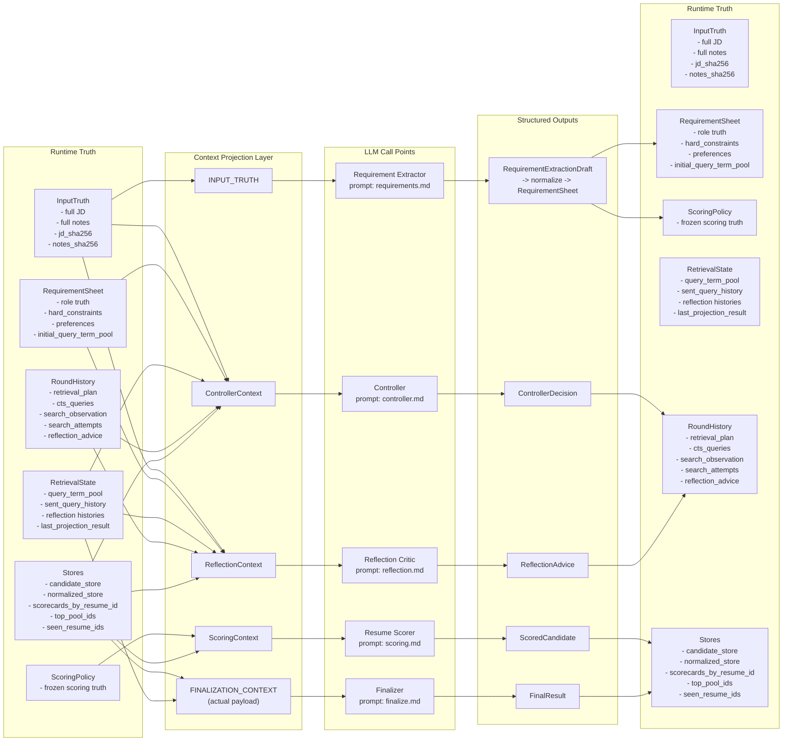
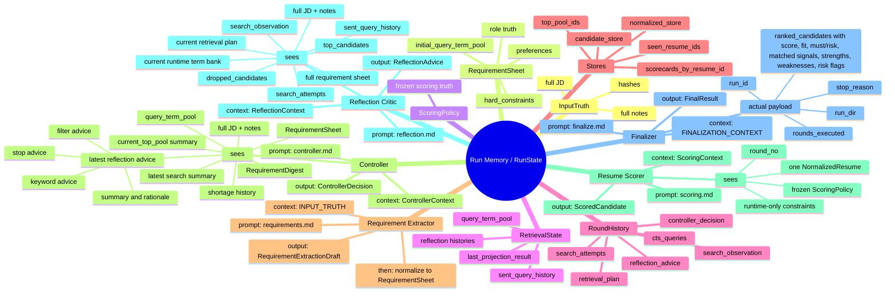
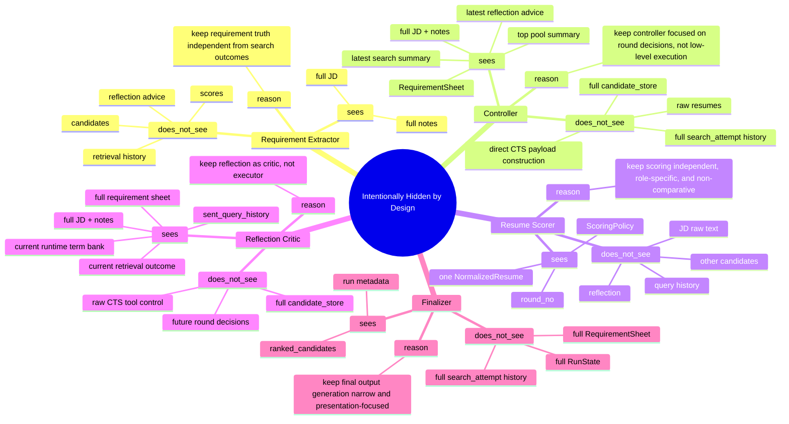

# SeekTalent v0.2 LLM Context Maps

> 本文档说明 `v0.2` 中 5 个 LLM 调用点的 context 分层方式：总 memory 是什么，runtime 如何从 memory 投影出各阶段 context，以及哪些信息是刻意不暴露给某个 LLM 的。

---

## 1. 总图：Runtime Truth -> Context -> LLM -> Output -> Runtime Truth

这张图表达的是：

- `RunState` 相关对象共同构成系统总 memory
- 各个 LLM 不直接读取全部 memory
- runtime 先做 deterministic context projection，再把投影结果交给对应 LLM
- 每个 LLM 的输出也都是结构化对象，而不是自由文本
- 第 1 列和第 5 列是同一套 runtime truth 结构；左边表示调用前，右边表示吸收 structured output 之后
- 图中保留了 runtime truth 的具体组成，不把细节压扁成抽象占位框
- `LLM Call Points` 的上下顺序按实际执行顺序展示：requirements -> controller -> scoring -> reflection -> finalizer

第 5 列表达的是这些具体更新：

- 第 1 行：`RequirementExtractionDraft` 会被归一化成 `RequirementSheet`，并冻结出 `ScoringPolicy`
- 第 2 行：`ControllerDecision` 会进入 `RoundHistory`，驱动下一步执行
- 第 3 行：`ScoredCandidate` 会进入 `Stores`，并参与排序和 top pool 更新
- 第 4 行：`ReflectionAdvice` 只作为建议历史写入 `RoundHistory`；controller/runtime 负责采纳和执行
- 第 5 行：`FinalResult` 会被 runtime 接住并写出最终产物；这是终点，不再进入下一轮循环

---

## 2. 思维导图：5 个 LLM 各自看到什么

这张图强调“谁看到什么”：

- `Requirement Extractor` 只看原始输入
- `Controller` 看完整业务真相，但只看运行态摘要，不看全量底层细节
- `Scorer` 看得最窄，只看含完整 hard constraints/preferences 的冻结评分标准、runtime-only constraints 和一份简历，不比较候选人
- `Reflection` 看得最宽，因为它负责复盘
- `Finalizer` 当前实际看到的是排序后的候选结果，不是全量 `RunState`

Reflection advice is advisory-only. Runtime records advice history, but controller/runtime own adoption and execution.

---

## 3. 对照图：哪些信息被刻意不给某个 LLM 看

这张图强调“为什么不让它看”：

- 不是信息越多越好
- 而是每个 LLM 只看完成自己任务所需的最小充分集
- 这样可以减少 prompt 噪音、避免职责漂移，也更容易审计

---

## 4. 当前实现上的一个细节

`FinalizeContext` 这个模型本身比 finalizer 实际看到的 payload 更宽。

当前 runtime 会构造 `FinalizeContext`，但真正发送给 finalizer LLM 的内容是更窄的 `FINALIZATION_CONTEXT`：

- `run_id`
- `run_dir`
- `rounds_executed`
- `stop_reason`
- `ranked_candidates` with score, fit, must/risk, matched signals, strengths, weaknesses, and risk flags

补充：

- 当前 run 目录里已经会把这 5 个调用点的真实 user payload 和结构化输出分别落盘成 call snapshot
- 因此这份 context 图现在不只是概念图，也对应可回放的 run artifacts

因此如果你在看代码时发现“模型定义比实际传参宽”，这是当前实现的刻意收口，不是遗漏。
