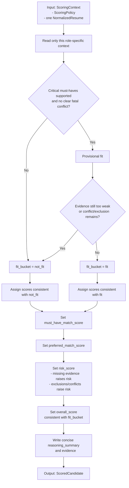
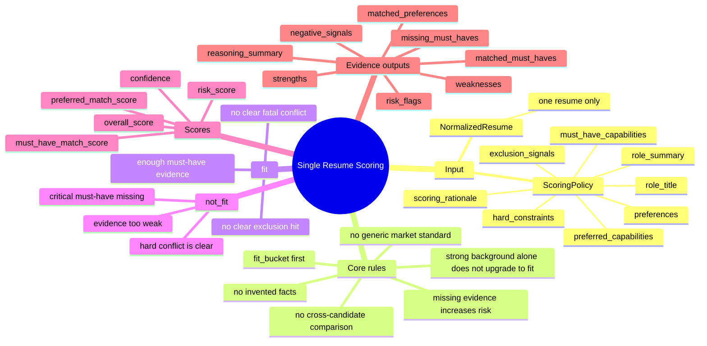
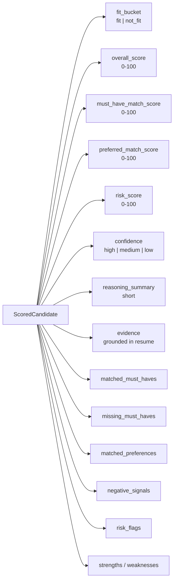

# v0.2 Scoring Rules Map

This document summarizes the current `v0.2` scoring semantics in a diagram-first form.

Source of truth:

- Prompt: [scoring.md](/Users/frankqdwang/Agents/cv-match/src/cv_match/prompts/scoring.md)
- Input and output models: [models.py](/Users/frankqdwang/Agents/cv-match/src/cv_match/models.py)

## 1. Decision Flow

## 2. Scoring Mind Map

## 3. Output Shape

## 4. Score Bands

Current prompt guidance:

- `90-100`: highly aligned
- `75-89`: strong
- `60-74`: mixed
- `40-59`: borderline
- `<40`: weak

These bands are guidance for consistency, not a replacement for `fit_bucket`.

## 5. Non-Rules

These are explicitly *not* part of scoring:

- No comparison against other candidates
- No use of generic market benchmarks
- No promotion to `fit` just because the resume looks broadly strong
- No assumptions beyond the provided resume evidence
