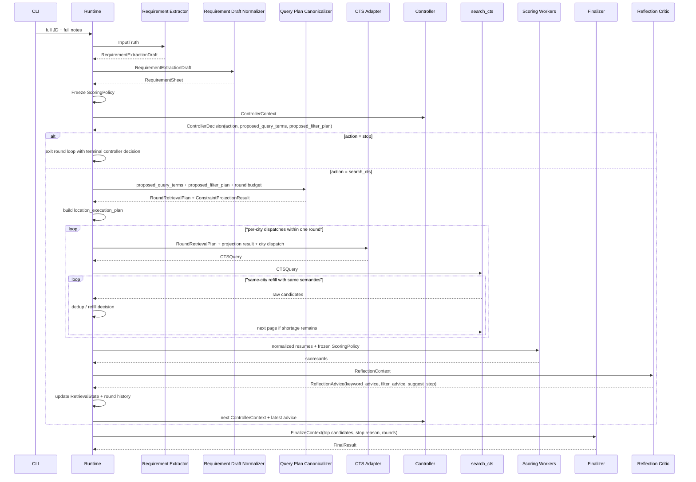

# cv-match v0.2 核心流程详解

> 本文档面向未参与 agent 开发的业务人员，用通俗语言解释 v0.2 系统从启动到结束的完整工作流程。
> 时序图原文来自 `design.md` §10.2。

---

## 时序图（原图）



---

## 参与者说明

在开始解释流程之前，先认识一下图中出现的所有"角色"：

| 角色 | 是什么 | 通俗类比 |
|------|--------|----------|
| CLI | 命令行入口 | 前台接待员，把客户的需求递进来 |
| Runtime | 流程总调度 | 项目经理，控制整个流程的节奏和规则 |
| Requirement Extractor | 需求抽取器（AI） | 需求分析师，先产出结构化草稿 |
| Requirement Draft Normalizer | 需求归一化器（确定性处理） | 质检员，把草稿清洗成最终 `RequirementSheet` |
| Query Plan Canonicalizer | 查询计划校验器 | 质检员，检查搜索方案是否符合规则 |
| CTS Adapter | CTS 适配器 | 翻译官，把业务语言翻译成简历库能理解的查询格式 |
| Controller | 控制器（AI） | 搜索策略师，每一轮做一次结构化决策 |
| search_cts | CTS 简历搜索服务 | 简历库，真正执行搜索并返回简历 |
| Scoring Workers | 评分工人（AI） | 面试官，逐份简历打分判断是否匹配岗位 |
| Reflection Critic | 反思评审（AI） | 复盘顾问，评价这一轮搜得好不好，给下一轮提改进建议 |
| Finalizer | 最终汇总器（AI） | 把最终候选池整理成输出结果 |

---

## 流程逐步解释

### 第一步：接收输入

```
CLI ->> Runtime: full JD + full notes
```

用户通过命令行提交两段文本：
- **JD**（Job Description）：岗位描述，包含职位名称、职责、技能要求等
- **notes**（寻访须知）：招聘方的补充说明，比如"优先考虑大厂背景"、"35岁以下"、"排除某某公司"等

这两段文本是整个系统的**唯一需求来源**，后续所有环节都不能脱离它们。

---

### 第二步：构建输入真相

```
Runtime ->> Extractor: InputTruth
```

Runtime 把原始文本封装成 `InputTruth`：

| 字段 | 含义 |
|------|------|
| `jd` | 完整的岗位描述原文 |
| `notes` | 完整的寻访须知原文 |
| `jd_sha256` | JD 的指纹（用于审计追溯，确认输入没被篡改） |
| `notes_sha256` | notes 的指纹 |

然后把它交给 Requirement Extractor 进行需求分析。

---

### 第三步：先抽取草稿，再归一化成 `RequirementSheet`

```
Extractor -->> Runtime: RequirementExtractionDraft
Runtime ->> Normalizer: RequirementExtractionDraft
Normalizer -->> Runtime: RequirementSheet
```

Requirement Extractor（AI）先阅读完整 JD 和 notes，输出一份结构化草稿。

随后 runtime 会做一次确定性的归一化，把草稿清洗成最终的 **需求清单** `RequirementSheet`：

| 字段 | 含义 | 举例 |
|------|------|------|
| `role_title` | 职位名称 | "高级 Python 工程师" |
| `role_summary` | 岗位概述（1-3句） | "负责简历匹配系统后端开发，需要 Python + AI 经验" |
| `must_have_capabilities` | 必须具备的能力 | ["Python 3年+", "熟悉 LLM 应用开发"] |
| `preferred_capabilities` | 加分项 | ["有推荐系统经验", "熟悉 Pydantic"] |
| `exclusion_signals` | 排除信号 | ["纯前端背景", "无 Python 经验"] |
| `hard_constraints` | 硬性筛选条件 | 地点=上海、学历=本科及以上、经验=3-5年 |
| `preferences` | 偏好条件（不作为硬性过滤） | 偏好大厂背景、偏好 AI 领域 |
| `initial_query_term_pool` | 候选搜索关键词池 | [python, LLM, "简历匹配", 推荐系统, ...] |
| `scoring_rationale` | 评分依据说明 | "核心看 Python + AI 应用能力，区分点在于是否有推荐系统经验" |

关键理解：
- **hard_constraints**（硬约束）= 不满足就直接扣分或排除，比如"必须在上海"
- **preferences**（偏好）= 满足了加分，不满足也不排除，比如"最好有大厂背景"
- **initial_query_term_pool** = 一个"候选词库"，不是直接发给简历库的搜索词。每个词带有类别（岗位锚点/领域/工具/扩展）和优先级
- 运行时真正交给 Controller 使用的是 `RetrievalState.query_term_pool`；它以 `initial_query_term_pool` 为 seed，并持续吸收 reflection 建议

---

### 第四步：冻结评分标准

```
Runtime ->> Runtime: Freeze ScoringPolicy
```

Runtime 从 RequirementSheet 中提取出一份**评分标准** `ScoringPolicy`，然后**冻结**它。

"冻结"的意思是：从这一刻起，不管后续搜索关键词怎么变、搜了几轮，评分标准始终不变。这保证了所有简历都在同一把尺子下被评判，不会因为搜索策略的调整而导致评分标准漂移。

---

### 第五步：Controller 决策

```
Runtime ->> Controller: ControllerContext
Controller -->> Runtime: ControllerDecision(action, proposed_query_terms, proposed_filter_plan)
```

Runtime 把当前所有相关信息打包成 `ControllerContext` 交给 Controller（AI）：

| 字段 | 含义 |
|------|------|
| `full_jd` / `full_notes` | 完整原始输入 |
| `requirement_sheet` | 结构化需求清单 |
| `round_no` | 当前是第几轮 |
| `min_rounds` / `max_rounds` | 最少/最多搜几轮 |
| `target_new` | 本轮期望找到多少新简历 |
| `query_term_pool` | 当前运行态候选查询词池（不是只看初始 seed pool） |
| `current_top_pool` | 目前已经找到的优质候选人摘要 |
| `latest_search_observation` | 上一轮搜索结果概况 |
| `latest_reflection_keyword_advice` | 反思顾问对关键词的建议 |
| `latest_reflection_filter_advice` | 反思顾问对筛选条件的建议 |
| `shortage_history` | 历史各轮的"缺口"记录 |

Controller 看完这些信息后，做出决策 `ControllerDecision`：

| 字段 | 含义 |
|------|------|
| `action` | `search_cts`（继续搜）或 `stop`（停止） |
| `proposed_query_terms` | 本轮建议使用的搜索关键词（第N轮必须恰好 N+1 个） |
| `proposed_filter_plan` | 本轮建议使用的筛选条件组合 |
| `thought_summary` | 简短的决策思路说明 |
| `decision_rationale` | 决策理由 |
| `response_to_reflection` | 对反思顾问建议的回应（接受/拒绝及原因） |
| `stop_reason` | 如果决定停止，说明原因 |

其中 `proposed_filter_plan` 包含：
- `pinned_filters`：必须保留的非地点筛选条件
- `optional_filters`：本轮选择启用的筛选条件
- `dropped_filter_fields`：本轮主动去掉的筛选条件
- `added_filter_fields`：本轮新增的筛选条件

注意：
- `location` 不再由 Controller 放进 `proposed_filter_plan`
- 地点集合来自 `RequirementSheet.hard_constraints.locations`
- 多地点优先级来自 `RequirementSheet.preferences.preferred_locations`
- runtime 会单独生成 `location_execution_plan`

---

这里补一个实现细节：

- `Controller` 当前代码里是“每轮一次结构化输出”
- 它不是在内部自己循环调用工具的那种多步 `ReAct`

### 分支 A：如果 Controller 决定停止

```
Runtime ->> Runtime: exit round loop with terminal controller decision
Runtime ->> Finalizer: FinalizeContext
Finalizer -->> Runtime: FinalResult
```

如果 Controller 认为已经找到足够多的优质候选人，或者继续搜也不会有更好的结果，就决定停止。

代码里的真实顺序不是“当场 finalize”，而是：

1. 先退出 round loop
2. 再构建 `FinalizeContext`
3. 最后单独调用 `Finalizer`

---

### 分支 B：如果 Controller 决定继续搜索

以下步骤在每一轮搜索中依次执行：

#### B1. 查询计划校验

```
Runtime ->> Canon: proposed_query_terms + proposed_filter_plan + round budget
Canon -->> Runtime: RoundRetrievalPlan + ConstraintProjectionResult
```

Query Plan Canonicalizer（质检员）检查 Controller 的提议是否合规：
- 关键词数量是否等于 `轮次号 + 1`？（第1轮2个词，第2轮3个词...）
- 关键词是否有重复？是否需要归一化？
- 筛选条件的枚举值是否合法？

校验通过后，输出两个东西：

**RoundRetrievalPlan**（本轮检索计划）：

| 字段 | 含义 |
|------|------|
| `round_no` | 第几轮 |
| `query_terms` | 最终确认的搜索关键词列表 |
| `keyword_query` | 关键词拼接后的搜索字符串（如 `python "简历匹配"`） |
| `projected_cts_filters` | 可以安全发给简历库的筛选条件 |
| `runtime_only_constraints` | 不能发给简历库、但在评分和排序时仍然生效的约束 |
| `location_execution_plan` | runtime 生成的地点执行计划 |
| `target_new` | 本轮期望新增简历数 |

**ConstraintProjectionResult**（约束投影结果）：

| 字段 | 含义 |
|------|------|
| `cts_native_filters` | 可以安全下发给简历库的字段 |
| `runtime_only_constraints` | 简历库不支持的约束，保留在系统内部用于评分 |
| `adapter_notes` | 记录哪些字段映射成功、哪些没有、原因是什么 |

为什么要分两层？因为有些业务约束（比如"35岁以下"）简历库不一定能直接过滤，但我们仍然需要在评分时考虑它。

#### B2. 适配器转换

```
Runtime ->> Adapter: RoundRetrievalPlan + projection result
Adapter -->> Runtime: CTSQuery
```

CTS Adapter（翻译官）把业务层的检索计划翻译成简历库能理解的查询格式 `CTSQuery`：

| 字段 | 含义 |
|------|------|
| `query_terms` | 搜索关键词 |
| `keyword_query` | 拼接后的搜索字符串 |
| `native_filters` | 简历库原生筛选字段（如 location="上海", degree="本科及以上"） |
| `page` / `page_size` | 分页参数 |
| `adapter_notes` | 适配过程中的备注 |

#### B3. 执行搜索 + 同轮补拉

```
Runtime ->> CTS: CTSQuery
loop "same-round refill with same semantics"
    CTS -->> Runtime: raw candidates
    Runtime ->> Runtime: dedup / refill decision
    Runtime ->> CTS: next page if shortage remains
end
```

Runtime 把 CTSQuery 发给简历库，简历库返回一批简历。

如果有地点约束，Runtime 不再发一个“多城市合并 query”，而是会按 `location_execution_plan` 把本轮预算拆到一个或多个城市上，每次 CTS 请求只带一个城市。

如果返回的简历去重后数量不够（比如很多是之前轮次已经见过的），Runtime 会在**当前城市 dispatch 内翻页补拉**。如果一个城市搜完仍有缺口，再按计划切到下一个城市或下一批预算。

#### B4. 逐份评分

```
Runtime ->> Scorer: normalized resumes + frozen ScoringPolicy
Scorer -->> Runtime: scorecards
```

Runtime 把新拿到的简历做标准化处理后，连同冻结的评分标准一起交给 Scoring Workers（AI 面试官）。

每份简历独立评分，评分员看到的信息只有：
- 冻结的评分标准（`ScoringPolicy`）
- 这一份简历的结构化摘要（`NormalizedResume`）
- 当前轮次号

评分员不会看到其他候选人的信息，也不会看到搜索历史。这保证了评分的独立性和一致性。

评分结果（scorecard）包括：是否匹配（fit/not_fit）、综合分、必备项匹配分、偏好匹配分、风险分、匹配证据、风险标记等。

当前实现里，评分阶段还会额外写 `scoring_calls.jsonl`，逐行保存每个 scoring branch 的真实输入 payload 与结构化输出，供离线 judge 和回放使用。

#### B5. 反思评审

```
Runtime ->> Reflector: ReflectionContext
Reflector -->> Runtime: ReflectionAdvice(keyword_advice, filter_advice, suggest_stop)
```

一轮搜索和评分结束后，Runtime 把完整的轮次信息打包成 `ReflectionContext` 交给 Reflection Critic（反思顾问）：

| 字段 | 含义 |
|------|------|
| `full_jd` / `full_notes` | 完整原始输入（确保反思不脱离需求） |
| `requirement_sheet` | 结构化需求清单 |
| `current_retrieval_plan` | 本轮实际执行的检索计划 |
| `search_observation` | 搜索结果统计（返回多少、新增多少、重复多少） |
| `top_candidates` | 当前优质候选人池 |
| `dropped_candidates` | 被淘汰的候选人 |
| `sent_query_history` | 历史所有轮次发过的搜索词记录 |

反思顾问输出 `ReflectionAdvice`：

| 字段 | 含义 |
|------|------|
| `strategy_assessment` | 整体策略是否在正确方向上？ |
| `quality_assessment` | 本轮找到的候选人质量如何？ |
| `coverage_assessment` | 是否覆盖了岗位的关键维度？ |
| `keyword_advice` | 关键词建议：建议新增/保留/降权/移除哪些词 |
| `filter_advice` | 筛选条件建议：建议保留/移除/新增哪些条件 |
| `suggest_stop` | 是否建议 Controller 在下一轮考虑停止 |
| `suggested_stop_reason` | 如果建议停止，说明推荐的停止原因 |
| `reflection_summary` | 简短的反思总结 |

关键理解：反思顾问只是**提建议**，不做最终决定，也不能直接结束 run。达到 `min_rounds` 之后，到 `max_rounds` 之前，只有 `Controller` 的 `stop` 能结束检索；`Runtime` 只负责 `min_rounds` 强制继续和 `max_rounds` 硬停止。地点执行由 runtime 独占，反思顾问最多只在文字层面评价“多城市覆盖是否合理”，不会直接返回 `location` filter advice。

#### B6. 更新状态，进入下一轮

```
Runtime ->> Runtime: update RetrievalState + round history
Runtime ->> Controller: next ControllerContext + latest advice
```

Runtime 把本轮的所有信息记录到历史中，并根据 `ReflectionAdvice` 更新 `RetrievalState.query_term_pool`。然后把更新后的上下文（包含反思顾问的最新建议和下一轮 query pool）交给 Controller，开始下一轮决策。

流程回到第五步，形成循环，直到 Controller 决定停止。

### B7. 审计与回放材料

`v0.2` 当前把审计材料分成两层：

- `JSON / JSONL`
  - canonical truth
  - 面向离线回放、自动检查和 `LLM-as-a-judge`
  - 包括各阶段 context、call snapshot、search/scoring 结果和 `judge_packet.json`
- `Markdown`
  - human view
  - 面向快速浏览和汇报
  - 包括 `round_review.md`、`run_summary.md`、`final_answer.md`

关键理解：

- judge 优先读 `judge_packet.json`
- 需要更深细节时，再回到各轮目录里的原始 JSON / JSONL
- `trace.log` 只保留短时间线，不替代结构化审计文件

---

## 最终输出

当 Controller 决定停止后，Runtime 从 `RunState`（运行状态）中汇总所有轮次的结果，生成最终的候选人推荐列表，包括：
- 排名靠前的候选人及其评分详情
- 每位候选人的匹配摘要
- 整个搜索过程的审计记录（每轮搜了什么词、为什么调整、反思顾问说了什么）

当前实现还会额外生成：

- `judge_packet.json`
  - 单文件聚合 run / requirements / rounds / final 四层关键判断材料
- `run_summary.md`
  - run 级目录索引和摘要

---

## 一句话总结

整个流程就像一个经验丰富的猎头团队在工作：
1. **需求分析师**先把客户的招聘需求翻译成结构化清单
2. **项目经理**冻结评分标准，确保公平
3. **搜索策略师**每轮选择少量精准关键词去简历库搜索（第1轮2个词，第2轮3个词，逐步扩大）
4. **面试官**对每份简历独立打分
5. **复盘顾问**评价这轮搜得好不好，给下一轮提建议
6. **搜索策略师**参考建议，决定下一轮怎么搜
7. 重复 3-6，直到找到足够多的优质候选人
