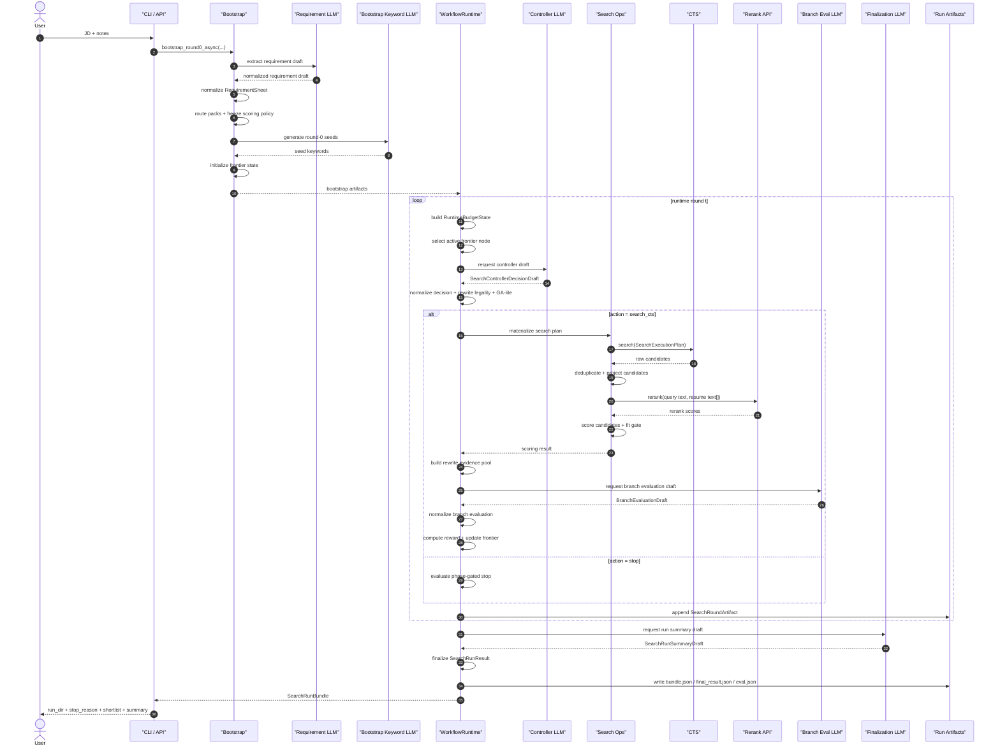
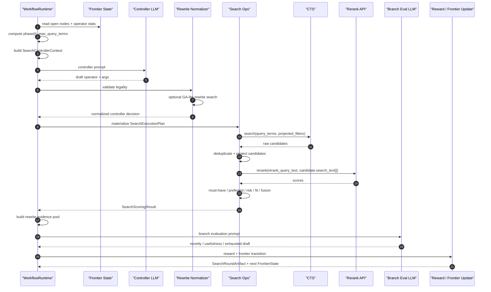

# SeekTalent Runtime Sequence

This page is a compact timing view of the active `v0.3.2` runtime. It complements [SYSTEM_MODEL](/Users/frankqdwang/Agents/SeekTalent/docs/v-0.3.2/SYSTEM_MODEL.md): the model defines the semantics, while this page shows the execution order.

## 1. End-to-End Run

### Notes

- Bootstrap freezes the requirement sheet and scoring policy before runtime starts.
- Runtime is frontier-based, not single-query iterative overwrite.
- A stop decision is still phase-gated; the runtime may reject it and continue into the next round.
- Artifacts are written as structured bundle data, not ad hoc logs.

## 2. Single Search Round

### Notes

- The controller does not own the frontier; it only chooses a local action for the active node.
- Rewrite normalization is deterministic after the LLM draft returns.
- Candidate scoring is `rerank + deterministic scoring + binary fit gate`.
- CTS returns raw candidates; sidecar projection owns deduplication and runtime audit tags.
- Reward update and stop evaluation are deterministic owners.

## 3. Timing-Critical Boundaries

- `RequirementSheet` is frozen before runtime; downstream stages should not re-derive requirements from raw JD text.
- `query_terms_hit(...)` is the shared text-match owner across selection, rewrite evidence, and scoring.
- Non-crossover search rounds execute a rewritten full query, not `parent query + appended terms`.
- `controller_stop` and `exhausted_low_gain` are phase-gated by the same runtime budget state, so a stop draft can be rejected without ending the run.

## Related Docs

- [System Model](/Users/frankqdwang/Agents/SeekTalent/docs/v-0.3.2/SYSTEM_MODEL.md)
- [Implementation Owners](/Users/frankqdwang/Agents/SeekTalent/docs/v-0.3.2/IMPLEMENTATION_OWNERS.md)
- [Architecture](/Users/frankqdwang/Agents/SeekTalent/docs/architecture.md)
