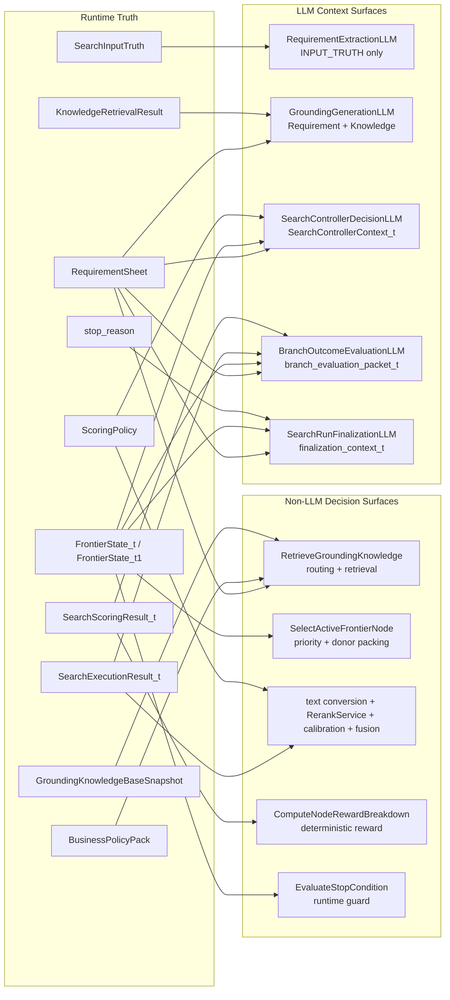

# SeekTalent v0.3 LLM Context Surfaces

> 本页是 `v0.3` 的总览页，只回答三件事：
> 1. 每个模型调用点真正看到什么
> 2. 哪些信息被刻意隐藏
> 3. 哪些 `v0.2` 里的 LLM 职责已经改成 `reranker` 或 deterministic logic
>
> 本页不持有字段级 contract。真正的 owner 仍然是 `payloads/`、`operators/`、`runtime/` 与 `semantics/`。
> trace 是 post-run offline artifact，owner 见 [[trace-spec]]，不属于任何 LLM 的 runtime context。

## 1. 总结论

`v0.3` 不是不要 context map，而是把 `v0.2` 的“单页总表”拆成了 `operator-owned local context packets`。

- 好处是每个调用点的 owner 更清楚
- 代价是没有一页能一眼看完整体
- 本页就是把这些 local packets 再汇总成业务可读的总览

补充约束：

- Phase 2+ 默认使用 `pydantic-ai` 作为 5 个 LLM 调用点的实现标准件，但它只负责 typed request/response wrapper，不接管 runtime loop。
- 5 个 LLM 调用点都必须使用 provider-native structured output，且要求 strict schema。
- 固定 `retries=0`、`output_retries=1`，不允许退回 prompted JSON、自由文本解析、tool fallback 或 fallback model chain。
- 每个调用点都必须先写入一个 draft payload，再由对应 operator 做 deterministic normalization。
- 只有 schema 无法表达的真实业务约束，才允许 bounded `output_validator + ModelRetry`。

### 1.1 Pydantic AI Runtime Policy

- 5 个调用点都使用 `fresh request per operator`；默认 `message_history = empty`。
- 默认使用 `instructions` 承载调用点级规则，不依赖累积式 `system_prompt` 历史。
- operator-owned local context packet 作为当前 user content；不额外拼接 run-global hidden memory。
- `function_tools`、`builtin_tools`、任意 MCP/tool calling 全部禁用。
- `allow_text_output = false`；不接受自由文本兜底。
- `allow_image_output = false`；当前 `v0.3` 不定义多模态输入面。
- 输出模式固定为 `NativeOutput`；`ToolOutput` 与 `PromptedOutput` 在 `v0.3` 中视为禁用能力。
- 不允许跨 operator 共享对话历史；唯一允许进入下一轮输入的附加消息是结构化校验失败后的 `RetryPromptPart`，且只允许单次 bounded retry。

## 2. 总图

## 3. 现有模型调用点

| 调用点                           | 真正看到的 context                                                                                                                | 刻意不暴露的内容                                                   | 草稿 owner -> 收口 owner                                                                                | `pydantic-ai` 执行约束                                                                 | 额外 validator 边界                                                               |
| ----------------------------- | ---------------------------------------------------------------------------------------------------------------------------- | ---------------------------------------------------------- | --------------------------------------------------------------------------------------------------- | ---------------------------------------------------------------------------------- | ----------------------------------------------------------------------------- |
| `RequirementExtractionLLM`    | `SearchInputTruth` 原始 `JD + notes`                                                                                           | 检索历史、frontier、候选、评分结果                                      | `RequirementExtractionDraft -> ExtractRequirements -> RequirementSheet`                             | fresh request；`instructions + SearchInputTruth`；`NativeOutput`；no tools/history | 默认不额外加 validator；主要靠 `ExtractRequirements` 做 deterministic normalization      |
| `GroundingGenerationLLM`      | `RequirementSheet + KnowledgeRetrievalResult`                                                                                | run 内检索历史、候选、frontier、CTS 细节、业务排序偏好                        | `GroundingDraft -> GenerateGroundingOutput -> GroundingOutput`                                      | fresh request；`instructions + local packet`；`NativeOutput`；no tools/history     | 默认不额外加 validator；主要靠 `GenerateGroundingOutput` 做 source-card / seed whitelist |
| `SearchControllerDecisionLLM` | `SearchControllerContext_t`：active node 摘要、合法 donor、frontier 头部摘要、未满足需求权重、operator 统计、allowed operators、term budget、fit gate | 整份 frontier、原始候选文本、底层 CTS payload、任意 donor 自由发现            | `SearchControllerDecisionDraft_t -> GenerateSearchControllerDecision -> SearchControllerDecision_t` | fresh request；`instructions + local packet`；`NativeOutput`；no tools/history     | 允许单次 bounded validator，只补充“能物化非空 query terms”与 runtime canonicalization 约束    |
| `BranchOutcomeEvaluationLLM`  | `branch_evaluation_packet_t`：parent baseline、本轮 query、semantic hash、page stats、node shortlist、top-three fused stats          | 全量 round history、完整 candidate store、未来轮次状态、底层 tool control | `BranchEvaluationDraft_t -> EvaluateBranchOutcome -> BranchEvaluation_t`                            | fresh request；`instructions + local packet`；`NativeOutput`；no tools/history     | 默认不额外加 validator；主要靠 clamp / whitelist / normalize                            |
| `SearchRunFinalizationLLM`    | `finalization_context_t`：`role_title`、must-have、hard constraints、`ranked_shortlist_candidate_ids`、`stop_reason`              | 整份 frontier、候选明细评分卡、原始 CTS 观测、任意排序改写权                      | `SearchRunSummaryDraft_t -> FinalizeSearchRun -> SearchRunResult`                                   | fresh request；`instructions + local packet`；`NativeOutput`；no tools/history     | 默认不额外加 validator；runtime 直接持有 shortlist 与 stop facts                          |

## 4. 每个调用点到底在做什么

### 4.1 `RequirementExtractionLLM`

- 这是 `v0.3` 最接近 `v0.2 INPUT_TRUTH` 的 surface。
- 它只负责把原始输入变成抽取草稿，不直接产出业务真相。
- 真正进入主链的是 `ExtractRequirements` 归一化后的 `RequirementSheet`。

对应 owner：
- [[ExtractRequirements]]
- [[RequirementExtractionDraft]]

### 4.2 `GroundingGenerationLLM`

- 这是 `v0.3` 新增的调用点。
- 它的职责不是“直接写搜索 query”，而是生成 grounding 草稿和 seed 候选。
- 它只读取 requirement 与受限的知识检索结果，不读取业务排序偏好。
- 一旦进入 `generic_fallback`，runtime 会强行忽略它的领域发散能力，只保留 deterministic generic seeds。

对应 owner：
- [[RetrieveGroundingKnowledge]]
- [[GenerateGroundingOutput]]
- [[GroundingDraft]]

### 4.3 `SearchControllerDecisionLLM`

- 这是 `v0.3` 里最典型的 local context packet。
- 控制器不再看到整份 run memory，只看当前 active node 的局部决策面。
- 它输出的是 operator patch，不是直接可执行的 CTS request。

对应 owner：
- [[SearchControllerContext_t]]
- [[SearchControllerDecisionDraft_t]]
- [[GenerateSearchControllerDecision]]

### 4.4 `BranchOutcomeEvaluationLLM`

- 这一步是 `v0.2 Reflection Critic` 的收窄版。
- 它不再负责“大范围复盘下一轮策略”，而是只判断当前 branch 有没有价值、是否枯竭、建议什么 repair operator。
- 它给 reward 和 stop 提供 branch-level 信号，但不直接修改 frontier。

对应 owner：
- [[BranchEvaluationDraft_t]]
- [[EvaluateBranchOutcome]]
- [[BranchEvaluation_t]]

### 4.5 `SearchRunFinalizationLLM`

- finalizer 只负责写最终总结，不再拥有任何排序或筛选事实改写权。
- shortlist 顺序已经由 runtime 在前面冻结好了，这里只读不改。

对应 owner：
- [[SearchRunSummaryDraft_t]]
- [[FinalizeSearchRun]]
- [[SearchRunResult]]

## 5. 哪些信息被刻意隐藏

### 5.1 对所有生成式模型都隐藏的内容

- 底层 CTS 原始 payload 构造细节
- runtime 预算与 stop guard 的完整内部状态机
- 可随意改写 shortlist 事实的权限

### 5.2 对控制器额外隐藏的内容

- 全量候选库
- 原始简历正文
- 全量 search attempts 日志
- 任意新 donor 的自由发现权

### 5.3 对 branch evaluator 额外隐藏的内容

- 整份 frontier
- 未来轮次决策
- 全量运行历史

### 5.4 对 finalizer 额外隐藏的内容

- 候选排序明细分数
- branch lineage
- 原始搜索过程

## 6. 哪些调用点已经不再是 LLM

`v0.2` 到 `v0.3` 最大的变化，不只是 context 变窄，还包括一部分职责已经完全移出生成式模型。

| 旧角色或旧印象 | `v0.3` 现在怎么做 |
| --- | --- |
| “LLM 主导排序” | 改成 `RerankService + calibration + deterministic fusion` |
| “Reflection 大范围复盘” | 改成更窄的 `BranchOutcomeEvaluationLLM`，外加 deterministic reward / stop |
| “控制器看整份 run memory” | 改成只看 `SearchControllerContext_t` |
| “首轮直接让 LLM 拼 query” | 改成 `RetrieveGroundingKnowledge` 先 route/retrieve，再让 `GroundingGenerationLLM` 产出草稿 |
| “停止主要靠模型感觉” | 改成 `EvaluateStopCondition` 的 runtime guard |

## 7. 和 `v0.2/llm-context-maps` 的一一对应

| `v0.2` | `v0.3` |
| --- | --- |
| `INPUT_TRUTH -> Requirement Extractor` | 仍保留，结构基本相同 |
| `ControllerContext -> Controller` | 改成更窄的 `SearchControllerContext_t` |
| `ScoringContext -> Resume Scorer` | 不再是生成式 LLM 主排序，改成 `ScoringPolicy + RerankService + deterministic fusion` |
| `ReflectionContext -> Reflection Critic` | 改成更窄的 `branch_evaluation_packet_t -> BranchOutcomeEvaluationLLM` |
| `FINALIZATION_CONTEXT -> Finalizer` | 仍保留，但上下文更窄，只读 shortlist 事实 |

补充边界：

- `RerankService` 只消费 `instruction / query / document-text`
- 它不是结构化 JSON scorer，也不是生成式解释节点
- 结构化候选对象必须先在 runtime scoring layer 转成自然文本

## 8. 阅读顺序

1. 先看 [[operator-map]]，知道系统里有哪些 LLM surface 和 non-LLM surface。
2. 再看本页，快速理解“谁真正看到什么”。
3. 然后按需点到具体 owner：
   - `RequirementExtractionLLM` 看 [[ExtractRequirements]]
   - `GroundingGenerationLLM` 看 [[RetrieveGroundingKnowledge]] 和 [[GenerateGroundingOutput]]
   - `SearchControllerDecisionLLM` 看 [[SearchControllerDecisionDraft_t]]、[[SearchControllerContext_t]] 和 [[GenerateSearchControllerDecision]]
   - `BranchOutcomeEvaluationLLM` 看 [[BranchEvaluationDraft_t]] 和 [[EvaluateBranchOutcome]]
   - `SearchRunFinalizationLLM` 看 [[SearchRunSummaryDraft_t]] 和 [[FinalizeSearchRun]]

## 相关

- [[design]]
- [[workflow-explained]]
- [[operator-map]]
- [[ExtractRequirements]]
- [[RetrieveGroundingKnowledge]]
- [[GenerateGroundingOutput]]
- [[SearchControllerContext_t]]
- [[SearchControllerDecisionDraft_t]]
- [[GenerateSearchControllerDecision]]
- [[BranchEvaluationDraft_t]]
- [[EvaluateBranchOutcome]]
- [[ScoreSearchResults]]
- [[SearchRunSummaryDraft_t]]
- [[FinalizeSearchRun]]
