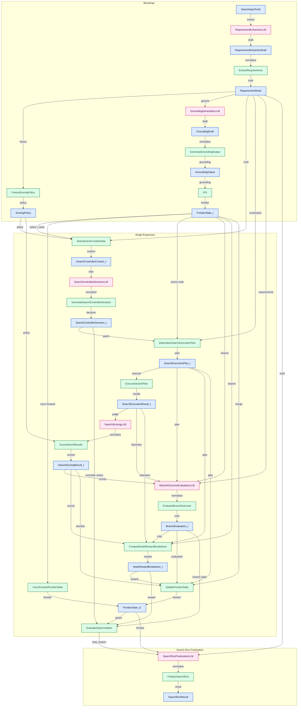

# SeekTalent v0.3 交互式数据流导图

> 本页是 `Obsidian` 导航入口。
> 它只提供单次 expansion 的主链导航，不重复定义字段级 contract。
> payload 的字段定义以 `payloads/` 为准，operator 的 read/write set 以 `operators/` 为准。

## 0. 阅读约定

1. 蓝色节点是 stable payload。
2. 绿色节点是 operator。
3. 粉色节点是 LLM / draft，不作为 canonical owner。
4. 带 `internal-link` 的节点可在 `Obsidian` 中直接点开对应 note。

## 1. 单次 Expansion 数据依赖图



## 2. Payload 入口

公式与 trace 中使用的短记号映射如下：

```text
R := RequirementSheet
P := ScoringPolicy
F_t := FrontierState_t
F_{t+1} := FrontierState_t1
n_t := active frontier node
d_t := SearchControllerDecision_t
p_t := SearchExecutionPlan_t
x_t := SearchExecutionResult_t
y_t := SearchScoringResult_t
a_t := BranchEvaluation_t
b_t := NodeRewardBreakdown_t
```

- [[SearchInputTruth]]
- [[RequirementExtractionDraft]]
- [[RequirementSheet]]
- [[ScoringPolicy]]
- [[GroundingDraft]]
- [[GroundingOutput]]
- [[GroundingEvidenceCard]]
- [[FrontierSeedSpecification]]
- [[FrontierState_t]]
- [[SearchControllerContext_t]]
- [[SearchControllerDecision_t]]
- [[SearchExecutionPlan_t]]
- [[SearchExecutionResult_t]]
- [[SearchScoringResult_t]]
- [[BranchEvaluation_t]]
- [[NodeRewardBreakdown_t]]
- [[FrontierState_t1]]
- [[SearchRunResult]]

## 3. Operator 入口

- 初始化链：[[ExtractRequirements]] -> [[FreezeScoringPolicy]] -> [[GenerateGroundingOutput]] -> [[InitializeFrontierState]]
- 单次扩展链：[[SelectActiveFrontierNode]] -> [[GenerateSearchControllerDecision]] -> [[MaterializeSearchExecutionPlan]] -> [[ExecuteSearchPlan]] -> [[ScoreSearchResults]]
- direct-stop 支路：[[CarryForwardFrontierState]] -> [[EvaluateStopCondition]]
- 闭环：[[EvaluateBranchOutcome]] -> [[ComputeNodeRewardBreakdown]] -> [[UpdateFrontierState]] -> [[EvaluateStopCondition]] -> [[FinalizeSearchRun]]
