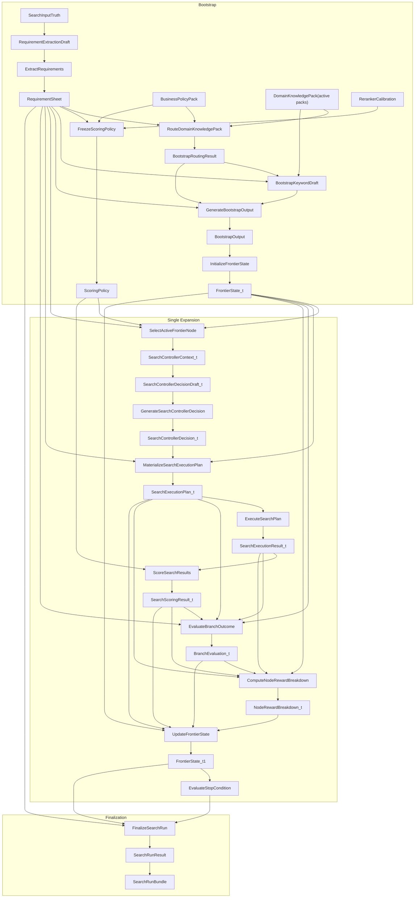

# SeekTalent v0.3 交互式数据流导图

> 本页只保留当前 `HEAD` 的主链导航。

## 1. Runtime 主图

## 2. 当前 bootstrap 入口

- [[SearchInputTruth]]
- [[RequirementExtractionDraft]]
- [[RequirementSheet]]
- [[BusinessPolicyPack]]
- [[DomainKnowledgePack]]
- [[BootstrapRoutingResult]]
- [[BootstrapKeywordDraft]]
- [[BootstrapOutput]]
- [[FrontierSeedSpecification]]
- [[FrontierState_t]]

## 3. 当前 expansion 入口

- [[SearchControllerContext_t]]
- [[SearchControllerDecisionDraft_t]]
- [[SearchControllerDecision_t]]
- [[SearchExecutionPlan_t]]
- [[SearchExecutionResult_t]]
- [[SearchScoringResult_t]]
- [[BranchEvaluationDraft_t]]
- [[BranchEvaluation_t]]
- [[NodeRewardBreakdown_t]]
- [[FrontierState_t1]]

## 4. Operator 入口

- bootstrap 链：[[ExtractRequirements]] -> [[RouteDomainKnowledgePack]] -> [[FreezeScoringPolicy]] -> [[GenerateBootstrapOutput]] -> [[InitializeFrontierState]]
- expansion 链：[[SelectActiveFrontierNode]] -> [[GenerateSearchControllerDecision]] -> [[MaterializeSearchExecutionPlan]] -> [[ExecuteSearchPlan]] -> [[ScoreSearchResults]]
- 闭环：[[EvaluateBranchOutcome]] -> [[ComputeNodeRewardBreakdown]] -> [[UpdateFrontierState]] -> [[EvaluateStopCondition]] -> [[FinalizeSearchRun]]

## 5. 已移除的旧 bootstrap 层

以下名称只保留历史意义，不再属于当前主图：

- [[RetrieveGroundingKnowledge]]
- [[GenerateGroundingOutput]]
- [[GroundingKnowledgeBaseSnapshot]]
- [[KnowledgeRetrievalResult]]
- [[GroundingDraft]]
- [[GroundingOutput]]
- [[GroundingKnowledgeCard]]
- [[GroundingEvidenceCard]]
