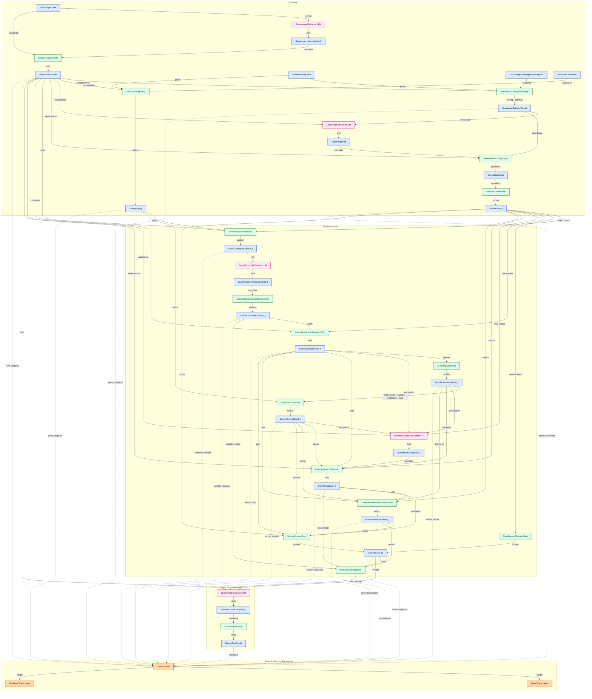

# SeekTalent v0.3 交互式数据流导图

> 本页是 `Obsidian` 导航入口。
> 它只提供 bootstrap 和单次 expansion 的主链导航，不重复定义字段级 contract。
> payload 的字段定义以 `payloads/` 为准，operator 的 read/write set 以 `operators/` 为准。
> runtime config / threshold / catalog 以 `runtime/` 为准，behavior-level helper 语义以 `semantics/` 为准。
> 图中只画 stable payload 主链，不画 `runtime/` 中 config / threshold / catalog 的读边。

## 0. 阅读约定

1. 蓝色节点是 stable payload。
2. 绿色节点是 operator。
3. 粉色节点是 LLM black box；draft payload 仍然是蓝色 payload node。
4. 橙色节点是离线 trace artifact，不属于 runtime 主流程。
5. 虚线表示离线渲染边，不表示 runtime read/write。
6. 带 `internal-link` 的节点可在 `Obsidian` 中直接点开对应 note。

## 1. Bootstrap + Single Expansion 数据依赖图



图中的 `Trace Bundle -> Agent Trace / Business Trace` 只表示：稳定 run artifacts 可以被离线渲染成双轨 trace；它不是新 operator，不参与 runtime 状态推进，也不回写 payload。

## 2. Core Payload Entry Points

公式与 `Agent Trace` 中使用的短记号映射如下：

```text
B := BusinessPolicyPack
KB := GroundingKnowledgeBaseSnapshot
K := KnowledgeRetrievalResult
C := RerankerCalibration
R := RequirementSheet
P := ScoringPolicy
F_t := FrontierState_t
F_{t+1} := FrontierState_t1
n_t := active frontier node
d_t := SearchControllerDecision_t
p_t := SearchExecutionPlan_t
x_t := SearchExecutionResult_t
y_t := SearchScoringResult_t
a_t := BranchEvaluation_t
b_t := NodeRewardBreakdown_t
```

- [[SearchInputTruth]]
- [[RequirementExtractionDraft]]
- [[RequirementSheet]]
- [[BusinessPolicyPack]]
- [[GroundingKnowledgeBaseSnapshot]]
- [[KnowledgeRetrievalResult]]
- [[RerankerCalibration]]
- [[ScoringPolicy]]
- [[GroundingDraft]]
- [[GroundingOutput]]
- [[FrontierSeedSpecification]]
- [[FrontierNode_t]]
- [[FrontierState_t]]
- [[SearchControllerContext_t]]
- [[SearchControllerDecisionDraft_t]]
- [[SearchControllerDecision_t]]
- [[SearchExecutionPlan_t]]
- [[SearchExecutionResult_t]]
- [[SearchScoringResult_t]]
- [[BranchEvaluationDraft_t]]
- [[BranchEvaluation_t]]
- [[NodeRewardBreakdown_t]]
- [[FrontierState_t1]]
- [[SearchRunSummaryDraft_t]]
- [[SearchRunResult]]

## 3. Embedded / Child Payloads

- [[CareerStabilityProfile]]
- [[ChildFrontierNodeStub]]
- [[FitGateConstraints]]
- [[GroundingEvidenceCard]]
- [[GroundingKnowledgeCard]]
- [[HardConstraints]]
- [[OperatorStatistics]]
- [[RequirementPreferences]]
- [[RetrievedCandidate_t]]
- [[RuntimeOnlyConstraints]]
- [[ScoringCandidate_t]]
- [[ScoredCandidate_t]]
- [[SearchObservation]]
- [[SearchPageStatistics]]

## 4. Operator 入口

- bootstrap 链：[[ExtractRequirements]] -> [[RetrieveGroundingKnowledge]] -> [[FreezeScoringPolicy]] -> [[GenerateGroundingOutput]] -> [[InitializeFrontierState]]
- 单次扩展链：[[SelectActiveFrontierNode]] -> [[GenerateSearchControllerDecision]] -> [[MaterializeSearchExecutionPlan]] -> [[ExecuteSearchPlan]] -> [[ScoreSearchResults]]
- direct-stop 支路：[[CarryForwardFrontierState]] -> [[EvaluateStopCondition]]
- 闭环：[[EvaluateBranchOutcome]] -> [[ComputeNodeRewardBreakdown]] -> [[UpdateFrontierState]] -> [[EvaluateStopCondition]] -> [[FinalizeSearchRun]]

## 5. Runtime Owner 入口

- [[OperatorCatalog]]
- [[KnowledgeRetrievalBudget]]
- [[RuntimeSearchBudget]]
- [[RuntimeTermBudgetPolicy]]
- [[CrossoverGuardThresholds]]
- [[StopGuardThresholds]]
- [[GroundingCatalog]]
- [[RuntimeRoundState]]
- [[cts-projection-policy]]

## 6. Semantics Owner 入口

- [[requirement-semantics]]
- [[retrieval-semantics]]
- [[grounding-semantics]]
- [[selection-plan-semantics]]
- [[scoring-semantics]]
- [[reward-frontier-semantics]]

## 7. Trace Entry Points

- [[trace-index]]
- [[trace-spec]]
- `traces/agent/*`
- `traces/business/*`
