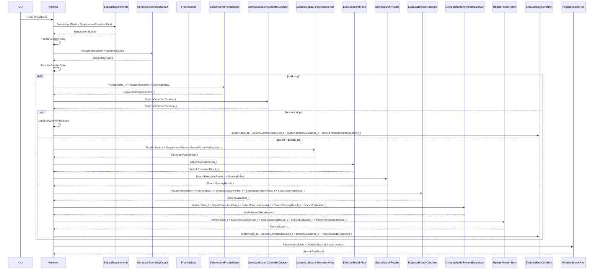

# SeekTalent v0.3 核心流程详解

> 本页面向业务协作者与工程读者，只负责解释流程，不负责持有字段级 contract。
> 对象形状以 `payloads/` 为准，operator 输入输出以 `operators/` 为准。
> 公式展开与白盒变换细节只看对应 operator 卡和 [[expansion-trace]]。

## 1. 总图

## 2. 这个流程真正表达的事

### 2.1 首轮启动不再裸奔

`GenerateGroundingOutput` 被插入到第一次 frontier 初始化之前。它的职责是把岗位领域知识整理成 `GroundingEvidenceCard` 与 `FrontierSeedSpecification`，供 `InitializeFrontierState` 使用。`InitializeFrontierState` 直接消费的是 `GroundingOutput`，而不是再回头直接读取 `RequirementSheet` 或 `ScoringPolicy`。

### 2.2 runtime 先选点，控制器后补丁

`SelectActiveFrontierNode` 先从 `FrontierState_t` 里选出最值得扩展的 branch，并打包成 `SearchControllerContext_t`。控制器只对这条 branch 生成 `SearchControllerDecision_t`，不再拥有全局 query ownership。

如果要看这一步如何从 context packing 走到 LLM draft，再走到 normalized decision，唯一 owner 是 [[GenerateSearchControllerDecision]]。

### 2.3 执行计划先固定，再去搜

`MaterializeSearchExecutionPlan` 把 operator patch 固化为 `SearchExecutionPlan_t`。其中 `query_terms`、`target_new_candidate_count`、`semantic_hash` 都在这一层固定，后面的 `ExecuteSearchPlan` 只负责执行。

具体哪些字段来自 parent node、哪些来自 `operator_args`、哪些来自 runtime clamp，统一以 [[MaterializeSearchExecutionPlan]] 为准。

### 2.4 反思与 reward 不再混写

`EvaluateBranchOutcome` 产出 `BranchEvaluation_t`，专门表达 novelty / usefulness / exhaustion 之类的 branch judgment。`ComputeNodeRewardBreakdown` 再把这些判断和搜索、评分事实合成 deterministic reward。

白盒变换细节不在本页重复，分别看 [[EvaluateBranchOutcome]] 与 [[ComputeNodeRewardBreakdown]]。

### 2.5 stop 与 finalize 都归 runtime

`EvaluateStopCondition` 统一裁决是否停止，`FinalizeSearchRun` 统一读取 `RequirementSheet + FrontierState_t1 + stop_reason` 输出 `SearchRunResult`。如果控制器直接建议 stop，runtime 会先经过 [[CarryForwardFrontierState]] 生成 direct-stop 路径下的 `FrontierState_t1`，再用 active node 已缓存的 branch judgment / reward 进入 stop guard；白盒规则以 [[EvaluateStopCondition]] 为准。

当前轮的 `FrontierState_t1` 在进入下一轮前，会经 runtime round shift 重绑定为下一轮的 `FrontierState_t`；这不是新的 operator。

## 3. 推荐阅读顺序

1. 先看 [[design]]，理解 owner 与原则。
2. 再看 [[operator-map]]，把 payload / operator 主链过一遍。
3. 然后按需看 `payloads/` 与 `operators/`。
4. 最后看 [[expansion-trace]]，确认单次 expansion 的字段流向。
