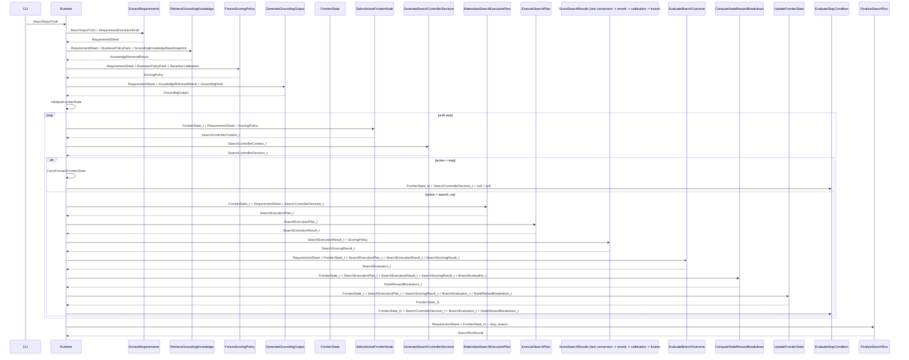

# SeekTalent v0.3 核心流程详解

> 本页面向业务协作者与工程读者，只负责解释流程，不负责持有字段级 contract。
> 对象形状以 `payloads/` 为准，operator 输入输出以 `operators/` 为准。
> 公式展开与白盒变换细节只看对应 operator 卡和 [[trace-index]] 中的 `Agent Trace`。

## 1. 总图

补充约束：

- 5 个 LLM 调用点都沿用 provider-native strict structured output。
- 内部草稿固定收口为：`RequirementExtractionDraft`、`GroundingDraft`、`SearchControllerDecisionDraft_t`、`BranchEvaluationDraft_t`、`SearchRunSummaryDraft_t`。
- runtime 固定 `retries=0`、`output_retries=1`；只有 schema 之外的真实业务约束才允许 bounded validator。

## 2. 这个流程真正表达的事

### 2.1 首轮启动先 route，再 retrieve

`RetrieveGroundingKnowledge` 被插入到 bootstrap 中，先根据 `BusinessPolicyPack` 和 `RequirementSheet` 走三选一 routing：

- `explicit_domain`：业务显式指定领域包，runtime 直接检索这些 pack
- `inferred_domain`：runtime 对当前已编译领域做 deterministic scoring，只取 1-2 个 pack
- `generic_fallback`：没有领域达标时不硬贴领域，直接回退到通用启动

之后 `GenerateGroundingOutput` 才基于 `RequirementSheet + KnowledgeRetrievalResult + GroundingDraft` 生成 round-0 seeds。

这意味着第一轮不再让 LLM 裸读 `JD + notes` 拼长 query，而是先决定“该不该信领域知识、能信哪几个领域包、哪些 bootstrap 阶段的 confusion signals 要避开”。

### 2.2 多 seed branch 替代单个长 query

`GenerateGroundingOutput` 不再追求一条“看起来像人写的完整 query”。它的输出是多个 `FrontierSeedSpecification`，每个 seed branch 只带 2-4 个 query terms，并显式记录 `seed_rationale`、`source_card_ids`、`expected_coverage`、`negative_terms`。

在 `generic_fallback` 下，seed 顺序也被写死，不允许再由 LLM 自由发散：

1. `role_title_anchor`
2. `must_have_core`
3. `coverage_repair`
4. 第 4/5 条只用于修复剩余未覆盖 must-have

`InitializeFrontierState` 直接消费这些短 seed branches，把它们转成 frontier 的初始 open nodes。

### 2.3 policy 与 calibration 被拆开

`BusinessPolicyPack` 表达业务偏好，`RerankerCalibration` 表达模型校准，`FreezeScoringPolicy` 再把两者与岗位真相冻结成 `ScoringPolicy`。

这样做有两个结果：

- 业务偏好可以按 run 冻结，但不会污染需求真相
- temperature / clip / offset 这类模型校准参数不再由业务 prompt 临时决定

### 2.4 评分不再由 LLM 主导排序

`ScoreSearchResults` 现在的核心是：

1. 用 reranker 产出 raw relevance
2. 用 calibration snapshot 做 deterministic normalization
3. 结合 must-have、preferred、hard constraint 和 stability risk 做 deterministic fusion
4. 产出 shortlist 与 explanation 候选集合

这里的 reranker 输入面是收紧的：

- `instruction` 是英文任务说明
- `query` 是岗位目标的 mixed query
- `document` 是候选自然文本

也就是说，runtime 会先把结构化候选状态压成 reranker 友好的 text-only surface，而不是把 JSON 直接喂给 reranker。

也就是说，LLM 只负责解释，不再决定主排序。

### 2.5 frontier 仍然是 runtime-owned，但允许定向交叉

`SelectActiveFrontierNode` 依然先选 active node，runtime 仍拥有搜索控制权。

新增的是：当另一个 open node 与 active node 共享锚点、能补足 unmet must-haves 且 reward 足够高时，它会被打包成 donor candidate。控制器可以选择 `crossover_compose`，但必须显式说明 donor、共享锚点和交叉理由；没有共享锚点时 runtime 会直接拒绝物化 child plan。

### 2.6 stop 与 finalize 仍归 runtime

`EvaluateStopCondition` 仍然统一裁决是否停止，`FinalizeSearchRun` 仍然在 run-global shortlist 事实基础上生成最终总结。

区别只是：现在最终 shortlist 的排序事实来自 reranker fusion，且可回溯到 `source_card_ids`、`ScoringPolicy` 和 `RerankerCalibration`。

direct-stop 不再依赖任何未定义 cache；在未执行 search/evaluate/reward 的轮次里，runtime 直接把 `BranchEvaluation_t` 与 `NodeRewardBreakdown_t` 作为 `null` 传给 stop guard。

## 3. 推荐阅读顺序

1. 先看 [[design]]，理解 owner、routing 与 generic fallback 边界。
2. 再看 [[knowledge-base]]，理解知识库和报告编译边界。
3. 再看 [[operator-map]]，把 payload / operator / runtime / semantics 主链过一遍。
4. 如果想快速理解“每个模型到底看到了什么”，再看 [[llm-context-surfaces]]。
5. 如果想快速确认所有系数、默认阈值和可配置权重，再看 [[weights-and-thresholds-index]]。
6. 然后按需看 `payloads/`、`runtime/`、`semantics/` 与 `operators/`。
7. 技术读者最后看 [[trace-index]] 中的 `Agent Trace`；业务读者最后看 paired `Business Trace`，确认同一 case 的流程、工具调用和结果解释。
