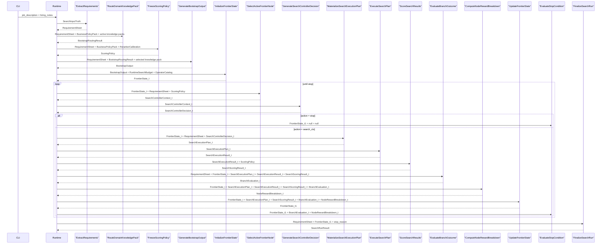

# SeekTalent v0.3 核心流程详解

> 本页只解释当前流程，不持有字段级 contract。

## 1. 总图

## 2. 这条主链真正表达的事

### 2.1 知识库只用一次

当前知识库只参与 bootstrap。

- 先 route 到单个领域包，或者走 generic fallback
- 再让 LLM 基于 `RequirementSheet + selected knowledge pack` 生成 round-0 关键词草稿
- 然后 runtime 把草稿 deterministic 地收口成 `FrontierSeedSpecification`

后续所有 search / ranking / frontier round 都不再继续读取知识库。

### 2.2 reranker 做两件事

同一个 reranker surface 现在同时服务：

- bootstrap 路由选包
- 候选排序打分

但这两个调用都只是打分，不是生成。

### 2.3 generic fallback 是明确分支

generic fallback 不是“弱领域命中”，而是：

- 不选中任何知识包
- 不生成 `domain_company`
- 只从 `RequirementSheet` 出发启动首轮查询

### 2.4 frontier 负责持续扩展

bootstrap 只负责造出初始 open nodes。

后面的事情都交给 frontier runtime：

- 选 active node
- 让控制器做局部 operator patch
- 物化检索计划
- 执行 CTS 搜索
- 排序
- 评估分支价值
- 更新 frontier
- 决定是否停止

### 2.5 artifacts-first

Phase 6 下，真正的运行事实不是单个 `SearchRunResult`，而是 `SearchRunBundle`。

bundle 会保留：

- bootstrap artifact
- 每轮 controller / plan / execution / scoring / evaluation / reward / stop 事实
- final result
- eval

## 3. 推荐阅读顺序

1. [[design]]
2. [[knowledge-base]]
3. [[operator-map]]
4. [[llm-context-surfaces]]
5. `payloads/`、`operators/`、`runtime/`、`semantics/`
6. [[trace-index]]
